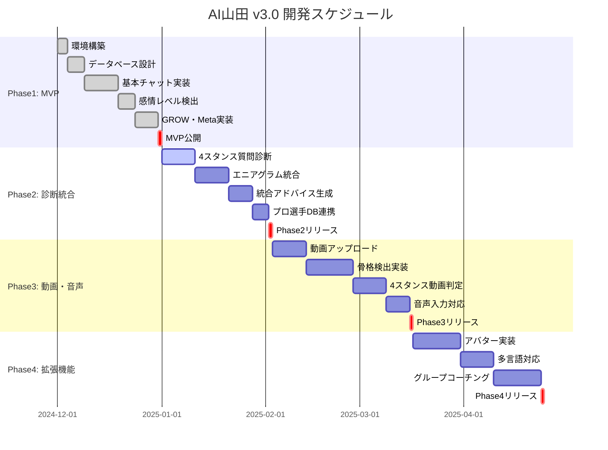

# 山田AI完全版実装仕様書 v3.0 統合版

**作成日**: 2025-12-09  
**バージョン**: v3.0  
**作成者**: AI山田開発チーム  
**承認者**: 山田秀  
**推定開発期間**: 約1ヶ月（Phase 2: 1週間 / Phase 3: +3週間）

---

## 📋 目次

1. [プロジェクト概要](#第1章プロジェクト概要)
2. [システム全体像](#第2章システム全体像)
3. [データベース設計](#第3章データベース設計)
4. [AI判定ロジック実装仕様](#第4章ai判定ロジック実装仕様)
5. [UI/UX設計](#第5章uiux設計)
6. [技術実装要件](#第6章技術実装要件)
7. [開発ロードマップ](#第7章開発ロードマップ)
8. [テスト仕様](#第8章テスト仕様)
9. [ビジネス戦略](#第9章ビジネス戦略)
10. [知的財産権戦略](#第10章知的財産権戦略)

---

## 第1章:プロジェクト概要

### 1.1 ビジョン

**「世界で唯一の完全パーソナライズドAIコーチング」**

山田秀氏の3000+セッションで培われた知見を完全AI化し、ユーザーの**身体特性（4スタンス）× 心理特性（エニアグラム）× 感情状態（3レベル）× 35種テニスメソッド**を統合した、世界に類を見ないデジタルコーチングシステムを実現する。

### 1.2 ミッション

1. **アクセシビリティ**: 地理的・経済的制約を超え、誰でも山田式コーチングにアクセス可能に
2. **パーソナライズ**: 一人一人の特性に100%最適化されたアドバイス提供
3. **継続性**: 24/7いつでもサポート、継続的な成長を支援
4. **スケーラビリティ**: 1人のコーチが1万人以上に同時対応可能な仕組み

### 1.3 ターゲットユーザー

#### プライマリーターゲット
- **テニス愛好家**（20-50歳、週1-3回プレー）
  - スキル向上に悩んでいる中級者
  - フォーム改善を求める初心者
  - メンタル面の強化を望む競技者

#### セカンダリーターゲット
- **ビジネスパーソン**（30-50歳）
  - パフォーマンス向上を求める経営者
  - 自己実現を目指すビジネスマン
  - メンタルコーチングに興味がある層

#### ターシャリーターゲット
- **コーチ・指導者**（25-60歳）
  - 指導力向上を目指すテニスコーチ
  - エニアグラムを活用したい教育者
  - 4スタンス理論を学びたい専門家

### 1.4 市場ポジショニング

#### 競合分析

| 項目 | 山田AI v3.0 | 一般的なコーチングAI | 対面コーチング |
|------|-------------|---------------------|----------------|
| パーソナライズ度 | ★★★★★（4次元統合） | ★★☆☆☆（質問応答のみ） | ★★★★☆（対面の限界） |
| アクセシビリティ | ★★★★★（24/7対応） | ★★★★☆（オンライン） | ★★☆☆☆（時間・場所制約） |
| 価格 | ★★★★★（月額5,000円） | ★★★☆☆（月額1-3万円） | ★☆☆☆☆（1回3-5万円） |
| 専門性 | ★★★★★（3000+セッション） | ★★☆☆☆（汎用AI） | ★★★★☆（個人の経験） |
| 継続性 | ★★★★★（永続サポート） | ★★★★☆（契約期間内） | ★★☆☆☆（セッション単位） |

#### 独自価値提案（UVP）

**「あなたよりもあなたを信じる、世界で唯一のデジタル山田秀」**

- ✅ **身体 × 心 × 感情 × メソッド**の4次元統合
- ✅ **3000+セッション**の実績に基づくアドバイス
- ✅ **山田式口調**（関西弁・丁寧語）で親しみやすい
- ✅ **押し付けない**コーチング（選択肢提示・自己決定促進）
- ✅ **月額5,000円**で無制限アクセス

### 1.5 ビジネスモデル

#### 収益構造

**フリーミアムモデル + サブスクリプション**

| プラン | 価格 | 提供機能 | 狙い |
|--------|------|----------|------|
| **無料版** | ¥0 | ・4スタンス簡易診断<br>・エニアグラム簡易診断（15問）<br>・基本テニスアドバイス（月3回まで）<br>・YouTube動画視聴 | ユーザー獲得・認知拡大 |
| **ベーシック版** | ¥3,000/月 | ・4スタンス完全診断（動画解析）<br>・エニアグラム完全診断（90問）<br>・AI山田チャット無制限<br>・35テニスメソッドフルアクセス<br>・メタアウトカム・GROWモデル | メインターゲット・安定収益 |
| **プレミアム版** | ¥5,000/月 | ・ベーシック版全機能<br>・月1回の山田秀本人との15分ビデオ通話<br>・専用練習メニュー自動生成<br>・進捗レポート（週次）<br>・優先サポート | ロイヤルユーザー・高収益 |
| **企業版** | 応相談 | ・チーム全体の診断・分析<br>・組織パフォーマンス向上<br>・カスタマイズメニュー<br>・専任サポート | B2B展開・大型契約 |

#### 収益シミュレーション（1年目）

```
【前提】
- 無料版ユーザー: 10,000人（YouTube経由）
- 無料→ベーシック転換率: 15%（業界平均10%を上回る）
- 無料→プレミアム転換率: 3%
- ベーシック→プレミアム転換率: 20%
- 解約率: 5%/月（業界平均8%を下回る）

【1年後の予測】
- ベーシック会員: 1,500人 × ¥3,000 = ¥4,500,000/月
- プレミアム会員: 300人 × ¥5,000 = ¥1,500,000/月
- 企業契約: 3社 × ¥300,000 = ¥900,000/月
- 合計月間売上: ¥6,900,000/月
- 年間売上: ¥82,800,000

【コスト】
- サーバー・API費用: ¥500,000/月
- マーケティング費: ¥1,000,000/月
- 人件費（山田氏+開発2名）: ¥2,000,000/月
- その他経費: ¥500,000/月
- 合計コスト: ¥4,000,000/月

【利益】
- 月間利益: ¥2,900,000
- 年間利益: ¥34,800,000
```

---

## 第2章:システム全体像

### 2.1 機能一覧（優先度付き）

#### MVP機能（Phase 1 - 完成済み）

| No. | 機能名 | 説明 | 優先度 | 状態 |
|-----|--------|------|--------|------|
| 1.1 | 感情レベル判定 | ユーザーの発言から3段階の感情レベルを自動判定 | P0 | ✅完成 |
| 1.2 | メタアウトカム | 短絡的ゴールから本質的欲求を5-6質問で引き出す | P0 | ✅完成 |
| 1.3 | GROWモデル | Goal/Reality/Options/Willの4ステップで行動計画作成 | P0 | ✅完成 |
| 1.4 | 関西弁対応 | 「〜やね」「ほんまに」等の山田式口調 | P0 | ✅完成 |
| 1.5 | 35テニスメソッド | 基本技術7+フットワーク4+戦術6+メンタル8+高度6+人生4 | P0 | ✅完成 |

#### Phase 2機能（本仕様書対象 - 実装中）

| No. | 機能名 | 説明 | 優先度 | 推定工数 |
|-----|--------|------|--------|----------|
| 2.1 | 4スタンス簡易判定 | 10問の質問で身体タイプ（A/F/U/W）を判定 | P0 | 2日 |
| 2.2 | エニアグラム完全診断 | 90問でタイプ+健全レベル+方向性を判定 | P0 | 3日 |
| 2.3 | 統合アドバイス生成 | 4スタンス×エニアグラム×感情レベル×35メソッド統合 | P0 | 2日 |
| 2.4 | YouTube動画統合 | 56本の解説動画をタイプ別・状況別に推薦 | P1 | 1日 |
| 2.5 | プロ選手マッピング | ジョコビッチ等のタイプ情報でユーザー理解促進 | P1 | 0.5日 |

#### Phase 3機能（将来実装 - 3週間後）

| No. | 機能名 | 説明 | 優先度 | 推定工数 |
|-----|--------|------|--------|----------|
| 3.1 | 動画解析（4スタンス） | フォアハンド+サーブ動画で自動判定（95%精度） | P0 | 1週間 |
| 3.2 | 動画解析（フォーム診断） | スイング軌道・重心移動を解析しアドバイス | P1 | 1週間 |
| 3.3 | 音声対話機能 | 音声入力・音声出力で自然な対話 | P2 | 1週間 |
| 3.4 | アバター山田 | 3D/2Dアバターで山田氏の表情・ジェスチャー再現 | P3 | 2週間 |

### 2.2 ユーザーフロー図（テキストベース）

```
┌─────────────────────────────────────┐
│ 🏠 トップページ                       │
│ - 無料診断開始ボタン                  │
│ - ログイン（既存ユーザー）            │
│ - YouTube動画サンプル                │
└────────────┬────────────────────────┘
             │
             ▼
┌─────────────────────────────────────┐
│ 📋 初回診断選択                       │
│ [A] 4スタンス簡易診断（10問・5分）    │
│ [B] エニアグラム簡易診断（15問・5分） │
│ [C] 完全診断（A+B+動画・30分）        │
│ [D] スキップして直接相談              │
└────────────┬────────────────────────┘
             │
             ▼（[A]または[C]を選択）
┌─────────────────────────────────────┐
│ 🎾 4スタンス診断                      │
│ ┌────────────────────────────────┐ │
│ │ Step 1: 重心タイプ判定（3問）      │ │
│ │ - つま先 or かかと？               │ │
│ └────────────────────────────────┘ │
│ ┌────────────────────────────────┐ │
│ │ Step 2: 力の方向判定（3問）        │ │
│ │ - 内側 or 外側？                   │ │
│ └────────────────────────────────┘ │
│ ┌────────────────────────────────┐ │
│ │ Step 3: 動作スタイル判定（4問）    │ │
│ │ - 直線 or 捻転？                   │ │
│ └────────────────────────────────┘ │
│ → 判定結果: A/F/U/W                  │
└────────────┬────────────────────────┘
             │
             ▼（[B]または[C]を選択）
┌─────────────────────────────────────┐
│ 🧭 エニアグラム診断                   │
│ ┌────────────────────────────────┐ │
│ │ Phase 1: タイプ絞り込み（30問）    │ │
│ │ → 上位3タイプ特定                  │ │
│ └────────────────────────────────┘ │
│ ┌────────────────────────────────┐ │
│ │ Phase 2: タイプ確定（30問）        │ │
│ │ → 最終タイプ決定（1-9）            │ │
│ └────────────────────────────────┘ │
│ ┌────────────────────────────────┐ │
│ │ Phase 3: 現在地診断（30問）        │ │
│ │ → 健全レベル + 方向性              │ │
│ └────────────────────────────────┘ │
│ → 判定結果: タイプ+レベル+方向       │
└────────────┬────────────────────────┘
             │
             ▼
┌─────────────────────────────────────┐
│ 📊 診断結果表示                       │
│ ┌────────────────────────────────┐ │
│ │ ✅ あなたの身体タイプ: A型         │ │
│ │ ✅ あなたの心理タイプ: タイプ2     │ │
│ │ ✅ 現在の状態: 健全・統合方向      │ │
│ └────────────────────────────────┘ │
│ ┌────────────────────────────────┐ │
│ │ 🎯 あなた専用アドバイス            │ │
│ │ - 身体の使い方                     │ │
│ │ - 心のパターン                     │ │
│ │ │ - 今日からできる一歩               │ │
│ └────────────────────────────────┘ │
│ [💬 AI山田と相談開始] [📺 動画を見る] │
└────────────┬────────────────────────┘
             │
             ▼（相談開始を選択）
┌─────────────────────────────────────┐
│ 💬 AI山田チャット画面                 │
│ ┌────────────────────────────────┐ │
│ │ 山田AI: 「こんにちは！何を相談     │ │
│ │         したいですか？」           │ │
│ └────────────────────────────────┘ │
│ ┌────────────────────────────────┐ │
│ │ ユーザー: 「フォアハンドが上手く   │ │
│ │           打てません」             │ │
│ └────────────────────────────────┘ │
│ ┌────────────────────────────────┐ │
│ │ 【内部処理】                       │ │
│ │ ① 感情レベル判定（Lv1: 前向き）   │ │
│ │ ② 4スタンスタイプ取得（A型）       │ │
│ │ ③ エニアグラムタイプ取得（タイプ2）│ │
│ │ ④ 35メソッドから最適選択           │ │
│ │ ⑤ 統合アドバイス生成               │ │
│ └────────────────────────────────┘ │
│ ┌────────────────────────────────┐ │
│ │ 山田AI: 「なるほど、フォアハンド   │ │
│ │ やね。○○さんはA型やから、母指球   │ │
│ │ 重心で、肩甲骨を使って...」        │ │
│ │                                    │ │
│ │ 【メタアウトカム開始】             │ │
│ │ 「フォアハンドが打てるようになっ   │ │
│ │ たら、何が得られますか？」         │ │
│ └────────────────────────────────┘ │
└────────────┬────────────────────────┘
             │
             ▼（セッション継続）
┌─────────────────────────────────────┐
│ 🎯 GROWモデルセッション               │
│ ┌────────────────────────────────┐ │
│ │ G (Goal): 本質的ゴール設定         │ │
│ │ 「試合で自信を持ってプレーする」   │ │
│ └────────────────────────────────┘ │
│ ┌────────────────────────────────┐ │
│ │ R (Reality/Resource): 現状把握     │ │
│ │ 「今は60点、基本はできてる」       │ │
│ └────────────────────────────────┘ │
│ ┌────────────────────────────────┐ │
│ │ O (Options): 選択肢検討            │ │
│ │ 「メソッド7（母指球重心）を試す」  │ │
│ └────────────────────────────────┘ │
│ ┌────────────────────────────────┐ │
│ │ W (Will): 行動計画                 │ │
│ │ 「明日の練習で20球試します」       │ │
│ └────────────────────────────────┘ │
└────────────┬────────────────────────┘
             │
             ▼
┌─────────────────────────────────────┐
│ 🎬 関連動画推薦                       │
│ ┌────────────────────────────────┐ │
│ │ 📺 A型のフォアハンド解説           │ │
│ │    （YouTube: 8分12秒）            │ │
│ │ 📺 母指球重心の作り方              │ │
│ │    （YouTube: 5分48秒）            │ │
│ │ 📺 ジョコビッチのフォアハンド分析  │ │
│ │    （A1タイプ参考例）              │ │
│ └────────────────────────────────┘ │
└────────────┬────────────────────────┘
             │
             ▼
┌─────────────────────────────────────┐
│ 📈 セッション終了・次回予約           │
│ ┌────────────────────────────────┐ │
│ │ ✅ 今日のまとめ                    │ │
│ │ - 本質ゴール: 自信を持つ           │ │
│ │ - 行動: 母指球重心で20球練習       │ │
│ │ - 次回: 実践結果をシェア           │ │
│ └────────────────────────────────┘ │
│ [📅 次回予約] [📊 履歴を見る]          │
│ [💳 プレミアムにアップグレード]        │
└─────────────────────────────────────┘
```

### 2.3 データフロー

```
┌──────────────┐
│ ユーザー入力 │
│ - テキスト   │
│ - 動画       │
│ - 音声       │
└──────┬───────┘
       │
       ▼
┌──────────────────────────────────┐
│ フロントエンド（Streamlit / Next.js）│
│ - 入力受付                           │
│ - データ整形                         │
│ - ローカルキャッシュ                 │
└──────┬───────────────────────────┘
       │
       ▼
┌──────────────────────────────────┐
│ APIゲートウェイ（FastAPI）           │
│ - 認証・認可                         │
│ - レート制限                         │
│ - ルーティング                       │
└──────┬───────────────────────────┘
       │
       ├────────┬────────┬────────┐
       ▼        ▼        ▼        ▼
┌──────────┐ ┌──────────┐ ┌──────────┐ ┌──────────┐
│ 感情判定 │ │ 4スタンス│ │エニアグラム│ │35メソッド│
│ モジュール│ │ 判定     │ │ 診断      │ │ DB      │
└──────┬───┘ └──────┬───┘ └──────┬───┘ └──────┬───┘
       │            │            │            │
       └────────────┼────────────┼────────────┘
                    │            │
                    ▼            ▼
            ┌──────────────────────┐
            │ 統合アドバイス生成エンジン│
            │ - ユーザープロファイル取得│
            │ - テンプレート選択        │
            │ - メソッド統合            │
            │ - GPT-4による最終調整     │
            └──────────┬───────────┘
                       │
                       ▼
            ┌──────────────────────┐
            │ PostgreSQL / Firestore │
            │ - ユーザープロファイル    │
            │ - セッション履歴          │
            │ - 診断結果                │
            └──────────┬───────────┘
                       │
                       ▼
            ┌──────────────────────┐
            │ レスポンス生成            │
            │ - 関西弁変換              │
            │ - マークダウンフォーマット│
            │ - 動画リンク挿入          │
            └──────────┬───────────┘
                       │
                       ▼
            ┌──────────────────────┐
            │ フロントエンド表示        │
            │ - チャット画面            │
            │ - 診断結果画面            │
            │ - 動画プレーヤー          │
            └──────────────────────┘
```

### 2.4 技術アーキテクチャ推奨

```
┌─────────────────────────────────────────────────────┐
│ クライアント層                                        │
│ ┌──────────────┐  ┌──────────────┐  ┌──────────────┐│
│ │ Web App      │  │ Mobile App   │  │ LINE Bot     ││
│ │ (Next.js)    │  │ (React Native)│  │ (Messaging API│
│ │ (Streamlit)  │  │             │  │)            ││
│ └──────────────┘  └──────────────┘  └──────────────┘│
└─────────────────────────────────────────────────────┘
                          ↓ HTTPS
┌─────────────────────────────────────────────────────┐
│ APIゲートウェイ層                                     │
│ ┌─────────────────────────────────────────────────┐ │
│ │ FastAPI / AWS API Gateway                       │ │
│ │ - JWT認証                                       │ │
│ │ - レート制限（10req/s/user）                    │ │
│ │ - ロードバランシング                            │ │
│ └─────────────────────────────────────────────────┘ │
└─────────────────────────────────────────────────────┘
                          ↓
┌─────────────────────────────────────────────────────┐
│ ビジネスロジック層                                    │
│ ┌──────────────┐  ┌──────────────┐  ┌──────────────┐│
│ │ 感情判定     │  │ 4スタンス    │  │エニアグラム  ││
│ │ サービス     │  │ 判定サービス │  │ 診断サービス ││
│ └──────────────┘  └──────────────┘  └──────────────┘│
│ ┌──────────────┐  ┌──────────────┐  ┌──────────────┐│
│ │ GROW         │  │メタアウトカム│  │ アドバイス   ││
│ │ エンジン     │  │ エンジン     │  │ 生成エンジン ││
│ └──────────────┘  └──────────────┘  └──────────────┘│
└─────────────────────────────────────────────────────┘
                          ↓
┌─────────────────────────────────────────────────────┐
│ AI/MLサービス層                                       │
│ ┌──────────────┐  ┌──────────────┐  ┌──────────────┐│
│ │ OpenAI       │  │ GPT-4 Vision │  │ Whisper      ││
│ │ GPT-4 API    │  │ API          │  │ (音声認識)   ││
│ └──────────────┘  └──────────────┘  └──────────────┘│
└─────────────────────────────────────────────────────┘
                          ↓
┌─────────────────────────────────────────────────────┐
│ データ層                                              │
│ ┌──────────────┐  ┌──────────────┐  ┌──────────────┐│
│ │ PostgreSQL   │  │ Redis Cache  │  │ S3 Storage   ││
│ │ (メインDB)   │  │ (セッション) │  │ (動画/画像)  ││
│ └──────────────┘  └──────────────┘  └──────────────┘│
└─────────────────────────────────────────────────────┘
```

---

## 第3章:データベース設計

### 3.1 ER図（テキスト表現）

```
┌──────────────────────────────────┐
│ users (ユーザー)                  │
├──────────────────────────────────┤
│ PK user_id: UUID                 │
│    email: VARCHAR(255)           │
│    password_hash: VARCHAR(255)   │
│    display_name: VARCHAR(100)    │
│    created_at: TIMESTAMP         │
│    updated_at: TIMESTAMP         │
│    subscription_plan: ENUM       │
│    subscription_end_date: DATE   │
└───────────┬──────────────────────┘
            │ 1
            │
            │ N
┌───────────▼──────────────────────┐
│ user_profiles (プロファイル)      │
├──────────────────────────────────┤
│ PK profile_id: UUID              │
│ FK user_id: UUID                 │
│    four_stance_type: CHAR(1)     │ ← A/F/U/W
│    four_stance_confidence: FLOAT │ ← 0.0-1.0
│    enneagram_type: INT           │ ← 1-9
│    enneagram_health: VARCHAR(20) │ ← healthy/average/unhealthy
│    enneagram_direction: VARCHAR  │ ← integration/neutral/disintegration
│    diagnosis_completed_at: TIMESTAMP │
│    last_updated_at: TIMESTAMP    │
└───────────┬──────────────────────┘
            │ 1
            │
            │ N
┌───────────▼──────────────────────┐
│ sessions (セッション履歴)         │
├──────────────────────────────────┤
│ PK session_id: UUID              │
│ FK user_id: UUID                 │
│    session_type: VARCHAR(50)     │ ← chat/diagnosis/video_analysis
│    emotion_level: INT            │ ← 1(前向き)/2(葛藤)/3(深刻)
│    meta_outcome_reached: BOOLEAN │
│    grow_completed: BOOLEAN       │
│    start_time: TIMESTAMP         │
│    end_time: TIMESTAMP           │
│    duration_seconds: INT         │
│    satisfaction_rating: INT      │ ← 1-5
└───────────┬──────────────────────┘
            │ 1
            │
            │ N
┌───────────▼──────────────────────┐
│ messages (メッセージ履歴)         │
├──────────────────────────────────┤
│ PK message_id: UUID              │
│ FK session_id: UUID              │
│    sender: ENUM                  │ ← user/ai
│    content: TEXT                 │
│    timestamp: TIMESTAMP          │
│    message_type: VARCHAR(50)     │ ← text/image/video/audio
│    metadata: JSONB               │ ← {emotion, methods_used, etc}
└──────────────────────────────────┘

┌──────────────────────────────────┐
│ tennis_methods (35メソッドDB)     │
├──────────────────────────────────┤
│ PK method_id: INT                │
│    category: VARCHAR(50)         │ ← 基本技術/フットワーク/etc
│    method_name: VARCHAR(100)     │
│    yamada_point: TEXT            │
│    mental_integration: TEXT      │
│    specific_technique: TEXT      │
│    common_issues: TEXT           │
│    suitable_for_4stance: CHAR[]  │ ← [A, F, U, W]
│    suitable_for_enneagram: INT[] │ ← [1,2,3...9]
└──────────────────────────────────┘

┌──────────────────────────────────┐
│ youtube_videos (動画マッピング)   │
├──────────────────────────────────┤
│ PK video_id: VARCHAR(20)         │
│    title: VARCHAR(255)           │
│    description: TEXT             │
│    duration_seconds: INT         │
│    url: VARCHAR(255)             │
│    four_stance_type: CHAR(1)     │ ← タイプ別動画
│    enneagram_type: INT           │ ← タイプ別動画
│    method_id: INT                │ ← 関連メソッド
│    keywords: TEXT[]              │
│    view_count: INT               │
│    upload_date: DATE             │
└──────────────────────────────────┘

┌──────────────────────────────────┐
│ pro_players (プロ選手マッピング)  │
├──────────────────────────────────┤
│ PK player_id: INT                │
│    player_name: VARCHAR(100)     │
│    four_stance_type: CHAR(1)     │ ← A/F/U/W
│    detailed_subtype: VARCHAR(10) │ ← A1/A2/B1/B2
│    play_style: VARCHAR(100)      │
│    signature_shot: VARCHAR(100)  │
│    career_highlights: TEXT       │
│    reference_video_urls: TEXT[]  │
└──────────────────────────────────┘
```

### 3.2 主要テーブル定義（SQL）

#### users テーブル

```sql
CREATE TABLE users (
    user_id UUID PRIMARY KEY DEFAULT gen_random_uuid(),
    email VARCHAR(255) UNIQUE NOT NULL,
    password_hash VARCHAR(255) NOT NULL,
    display_name VARCHAR(100),
    created_at TIMESTAMP DEFAULT CURRENT_TIMESTAMP,
    updated_at TIMESTAMP DEFAULT CURRENT_TIMESTAMP,
    subscription_plan VARCHAR(20) CHECK (subscription_plan IN ('free', 'basic', 'premium', 'enterprise')),
    subscription_start_date DATE,
    subscription_end_date DATE,
    is_active BOOLEAN DEFAULT true,
    last_login_at TIMESTAMP,
    INDEX idx_email (email),
    INDEX idx_subscription_plan (subscription_plan)
);
```

#### user_profiles テーブル

```sql
CREATE TABLE user_profiles (
    profile_id UUID PRIMARY KEY DEFAULT gen_random_uuid(),
    user_id UUID NOT NULL REFERENCES users(user_id) ON DELETE CASCADE,
    
    -- 4スタンス理論
    four_stance_type CHAR(1) CHECK (four_stance_type IN ('A', 'F', 'U', 'W')),
    four_stance_confidence FLOAT CHECK (four_stance_confidence BETWEEN 0 AND 1),
    four_stance_diagnosis_method VARCHAR(20) CHECK (four_stance_diagnosis_method IN ('question', 'video')),
    four_stance_diagnosed_at TIMESTAMP,
    
    -- エニアグラム
    enneagram_type INT CHECK (enneagram_type BETWEEN 1 AND 9),
    enneagram_health_level VARCHAR(20) CHECK (enneagram_health_level IN ('healthy', 'average', 'unhealthy')),
    enneagram_direction VARCHAR(20) CHECK (enneagram_direction IN ('integration', 'neutral', 'disintegration')),
    enneagram_diagnosed_at TIMESTAMP,
    
    -- メタデータ
    last_updated_at TIMESTAMP DEFAULT CURRENT_TIMESTAMP,
    diagnosis_version VARCHAR(10) DEFAULT 'v3.0',
    
    UNIQUE(user_id),
    INDEX idx_four_stance (four_stance_type),
    INDEX idx_enneagram (enneagram_type)
);
```

#### sessions テーブル

```sql
CREATE TABLE sessions (
    session_id UUID PRIMARY KEY DEFAULT gen_random_uuid(),
    user_id UUID NOT NULL REFERENCES users(user_id) ON DELETE CASCADE,
    session_type VARCHAR(50) NOT NULL,
    
    -- 感情・コーチング状態
    initial_emotion_level INT CHECK (initial_emotion_level BETWEEN 1 AND 3),
    final_emotion_level INT CHECK (final_emotion_level BETWEEN 1 AND 3),
    meta_outcome_reached BOOLEAN DEFAULT false,
    meta_outcome_content TEXT,
    grow_completed BOOLEAN DEFAULT false,
    grow_goal TEXT,
    grow_will TEXT,
    
    -- タイミング
    start_time TIMESTAMP NOT NULL DEFAULT CURRENT_TIMESTAMP,
    end_time TIMESTAMP,
    duration_seconds INT,
    
    -- フィードバック
    satisfaction_rating INT CHECK (satisfaction_rating BETWEEN 1 AND 5),
    user_comment TEXT,
    
    INDEX idx_user_sessions (user_id, start_time DESC),
    INDEX idx_session_type (session_type)
);
```

#### messages テーブル

```sql
CREATE TABLE messages (
    message_id UUID PRIMARY KEY DEFAULT gen_random_uuid(),
    session_id UUID NOT NULL REFERENCES sessions(session_id) ON DELETE CASCADE,
    sender VARCHAR(10) NOT NULL CHECK (sender IN ('user', 'ai')),
    content TEXT NOT NULL,
    timestamp TIMESTAMP NOT NULL DEFAULT CURRENT_TIMESTAMP,
    message_type VARCHAR(50) DEFAULT 'text',
    
    -- メタデータ（JSONB）
    metadata JSONB DEFAULT '{}',
    -- 例: {"emotion_detected": "positive", "methods_suggested": [1, 5, 12], "video_recommended": "abc123"}
    
    INDEX idx_session_messages (session_id, timestamp ASC)
);
```

#### tennis_methods テーブル

```sql
CREATE TABLE tennis_methods (
    method_id SERIAL PRIMARY KEY,
    category VARCHAR(50) NOT NULL,
    method_name VARCHAR(100) NOT NULL,
    yamada_point TEXT,
    mental_integration TEXT,
    specific_technique TEXT,
    common_issues TEXT,
    
    -- 適合性フィルタ
    suitable_for_4stance CHAR[] DEFAULT ARRAY['A','F','U','W'],
    suitable_for_enneagram INT[] DEFAULT ARRAY[1,2,3,4,5,6,7,8,9],
    suitable_for_emotion_level INT[] DEFAULT ARRAY[1,2,3],
    
    -- メタデータ
    usage_count INT DEFAULT 0,
    effectiveness_rating FLOAT DEFAULT 0.0,
    created_at TIMESTAMP DEFAULT CURRENT_TIMESTAMP,
    
    INDEX idx_category (category),
    INDEX idx_4stance_filter (suitable_for_4stance)
);
```

#### youtube_videos テーブル

```sql
CREATE TABLE youtube_videos (
    video_id VARCHAR(20) PRIMARY KEY,
    title VARCHAR(255) NOT NULL,
    description TEXT,
    duration_seconds INT,
    url VARCHAR(255) NOT NULL,
    thumbnail_url VARCHAR(255),
    
    -- タイプ別マッピング
    four_stance_type CHAR(1) CHECK (four_stance_type IN ('A', 'F', 'U', 'W', NULL)),
    enneagram_type INT CHECK (enneagram_type BETWEEN 1 AND 9 OR enneagram_type IS NULL),
    related_method_id INT REFERENCES tennis_methods(method_id),
    
    -- 検索・推薦用
    keywords TEXT[],
    target_audience VARCHAR(50), -- beginner/intermediate/advanced
    video_category VARCHAR(50), -- lesson/theory/demo/pro_analysis
    
    -- 統計
    view_count INT DEFAULT 0,
    recommendation_count INT DEFAULT 0,
    upload_date DATE,
    
    INDEX idx_four_stance_videos (four_stance_type),
    INDEX idx_enneagram_videos (enneagram_type),
    INDEX idx_video_category (video_category)
);
```

#### pro_players テーブル

```sql
CREATE TABLE pro_players (
    player_id SERIAL PRIMARY KEY,
    player_name VARCHAR(100) NOT NULL UNIQUE,
    four_stance_type CHAR(1) NOT NULL CHECK (four_stance_type IN ('A', 'F', 'U', 'W')),
    detailed_subtype VARCHAR(10), -- A1, A2, B1, B2
    
    -- プレースタイル
    play_style VARCHAR(100),
    dominant_hand VARCHAR(10) CHECK (dominant_hand IN ('right', 'left', 'ambidextrous')),
    signature_shot VARCHAR(100),
    career_highlights TEXT,
    
    -- 参考資料
    reference_video_urls TEXT[],
    analysis_notes TEXT,
    
    -- メタデータ
    is_active BOOLEAN DEFAULT true,
    ranking_peak INT,
    
    INDEX idx_four_stance_players (four_stance_type)
);
```

### 3.3 データ投入例

#### 35テニスメソッドのサンプルデータ

```sql
INSERT INTO tennis_methods (method_id, category, method_name, yamada_point, mental_integration, specific_technique, common_issues, suitable_for_4stance, suitable_for_enneagram) VALUES
(1, '基本技術', 'グリップの握り方', '4スタンスタイプで最適な握り方が異なる', '握りを変えるだけで安心感が生まれる', 'A型:親指・人差し指側、F型:小指・薬指側', '力み過ぎ、グリップチェンジの遅れ', ARRAY['A','F','U','W'], ARRAY[1,2,3,4,5,6,7,8,9]),
(2, '基本技術', 'スタンス(構え)', '重心位置がパフォーマンスを左右する', '正しいスタンスで心も安定', 'A/F型:前重心、U/W型:後ろ重心', '重心が不安定、足幅が狭い', ARRAY['A','F','U','W'], ARRAY[1,2,3,4,5,6,7,8,9]),
-- ... 残り33メソッド
;
```

#### プロ選手マッピングのサンプルデータ

```sql
INSERT INTO pro_players (player_name, four_stance_type, detailed_subtype, play_style, dominant_hand, signature_shot, career_highlights) VALUES
('ノバク・ジョコビッチ', 'A', 'A1', 'オールラウンダー', 'right', '両サイドの正確なグラウンドストローク', 'グランドスラム24勝（歴代最多）'),
('錦織圭', 'A', 'A2', 'アグレッシブベースライナー', 'right', 'エアK（ジャンピングフォアハンド）', 'ATPツアー12勝、全米準優勝'),
('スタン・ワウリンカ', 'U', 'B1', 'パワーベースライナー', 'right', '片手バックハンド', 'グランドスラム3勝'),
('ロジャー・フェデラー', 'W', 'B2', '攻撃的オールラウンダー', 'right', 'フォアハンド', 'グランドスラム20勝'),
('ラファエル・ナダル', 'A', 'A1', 'クレーキング', 'left', 'フォアハンドトップスピン', 'グランドスラム22勝、全仏14勝')
;
```

#### YouTube動画のサンプルデータ

```sql
INSERT INTO youtube_videos (video_id, title, description, duration_seconds, url, four_stance_type, video_category, keywords, target_audience) VALUES
('VBJbT2R3uuU', 'A型のフォアハンド解説', '母指球重心でのフォアハンドの打ち方', 492, 'https://www.youtube.com/watch?v=VBJbT2R3uuU', 'A', 'lesson', ARRAY['フォアハンド','A型','母指球重心'], 'intermediate'),
('4q6pEfEICco', 'サーブの4スタンス理論', '各タイプ別のサーブの打ち方', 615, 'https://www.youtube.com/watch?v=4q6pEfEICco', NULL, 'theory', ARRAY['サーブ','4スタンス'], 'beginner'),
('plKmlSr8x58', 'ジョコビッチのフォアハンド分析', 'A1タイプの典型例', 387, 'https://www.youtube.com/watch?v=plKmlSr8x58', 'A', 'pro_analysis', ARRAY['ジョコビッチ','A型','分析'], 'advanced')
;
```

---

## 第4章:AI判定ロジック実装仕様

### 4.1 感情レベル判定（3段階）

#### 判定ロジック

```python
class EmotionLevelDetector:
    """
    ユーザーの発言から感情レベルを判定（3段階）
    """
    
    # レベル1: 前向き（GROW直行）
    LEVEL1_KEYWORDS = [
        '〜したい', '〜になりたい', '目標', '頑張る', '挑戦', 
        '上達', '改善', 'できるようになりたい', 'やってみたい'
    ]
    
    # レベル2: 葛藤（メタアウトカム→GROW）
    LEVEL2_KEYWORDS = [
        'モヤモヤ', 'でも', 'けど', 'どうすれば', '悩んでる',
        '迷ってる', 'わからない', '困ってる', 'うまくいかない'
    ]
    
    # レベル3: 深刻（完全受容+1%探し）
    LEVEL3_KEYWORDS = [
        'もう無理', 'できない', '諦めた', 'ダメ', '辛い',
        '苦しい', '最悪', 'もうイヤ', '絶望', '自信がない'
    ]
    
    def detect(self, user_message: str) -> int:
        """
        Args:
            user_message: ユーザーの発言
        
        Returns:
            1, 2, or 3 (感情レベル)
        """
        message_lower = user_message.lower()
        
        # レベル3（深刻）を最優先で判定
        level3_score = sum(
            1 for kw in self.LEVEL3_KEYWORDS 
            if kw in message_lower
        )
        if level3_score >= 2:  # 2つ以上のキーワードで確定
            return 3
        
        # レベル2（葛藤）を次に判定
        level2_score = sum(
            1 for kw in self.LEVEL2_KEYWORDS 
            if kw in message_lower
        )
        if level2_score >= 1:
            return 2
        
        # レベル1（前向き）を最後に判定
        level1_score = sum(
            1 for kw in self.LEVEL1_KEYWORDS 
            if kw in message_lower
        )
        if level1_score >= 1:
            return 1
        
        # デフォルトはレベル2（慎重に対応）
        return 2
```

#### 実装例

```python
# 使用例
detector = EmotionLevelDetector()

# テストケース
test_cases = [
    ("フォアハンドが上手く打てるようになりたいです", 1),  # 前向き
    ("サーブを改善したいけど、どうすればいいかわからないんです", 2),  # 葛藤
    ("もう無理です。何をやってもダメで、自信がありません", 3)  # 深刻
]

for message, expected_level in test_cases:
    detected = detector.detect(message)
    assert detected == expected_level, f"Failed: {message}"
    print(f"✅ '{message}' → Level {detected}")
```

### 4.2 4スタンスタイプ判定

#### 4.2.1 質問ベース判定（Phase 2）

**10問の質問で3ステップ判定**

```python
class FourStanceDiagnoser:
    """
    10問の質問で4スタンスタイプを判定
    """
    
    QUESTIONS = {
        # Step 1: Upper(前重心) vs Down(後ろ重心) - 3問
        'upper_down': [
            {
                'id': 1,
                'text': 'テニスをプレーするとき、どちらの重心が心地よいですか？',
                'options': [
                    {'text': 'つま先・母指球に重心を置く', 'type': 'U', 'score': 1},
                    {'text': 'かかとに重心を置く', 'type': 'D', 'score': 1}
                ]
            },
            {
                'id': 2,
                'text': 'ボールを打つ瞬間、どの関節を意識しますか？',
                'options': [
                    {'text': '肩・手首を積極的に使う', 'type': 'U', 'score': 1},
                    {'text': '肘・膝を積極的に使う', 'type': 'D', 'score': 1}
                ]
            },
            {
                'id': 3,
                'text': 'グリップを握るとき、どう握るのが自然ですか？',
                'options': [
                    {'text': '指先でしっかり握る', 'type': 'U', 'score': 1},
                    {'text': '手のひら全体で包み込む', 'type': 'D', 'score': 1}
                ]
            }
        ],
        
        # Step 2: Inner(内側) vs Outer(外側) - 3問
        'inner_outer': [
            {
                'id': 4,
                'text': '足のどこに力が入りやすいですか？',
                'options': [
                    {'text': '親指・人差し指側（内側）', 'type': 'I', 'score': 1},
                    {'text': '小指・薬指側（外側）', 'type': 'O', 'score': 1}
                ]
            },
            {
                'id': 5,
                'text': '手のどこに力が入りやすいですか？',
                'options': [
                    {'text': '親指・人差し指側（内側）', 'type': 'I', 'score': 1},
                    {'text': '小指・薬指側（外側）', 'type': 'O', 'score': 1}
                ]
            },
            {
                'id': 6,
                'text': '体のバランスをとるとき、どちらを意識しますか？',
                'options': [
                    {'text': '体の中心線（内側）', 'type': 'I', 'score': 1},
                    {'text': '体の外側ライン', 'type': 'O', 'score': 1}
                ]
            }
        ],
        
        # Step 3: Straight(直線) vs Cross(捻転) - 4問
        'straight_cross': [
            {
                'id': 7,
                'text': 'ストロークを打つとき、体の動きは？',
                'options': [
                    {'text': '捻りを抑えて直線的に打つ', 'type': 'S', 'score': 1},
                    {'text': '積極的に体を捻って打つ', 'type': 'C', 'score': 1}
                ]
            },
            {
                'id': 8,
                'text': 'サーブを打つとき、足のスタンスは？',
                'options': [
                    {'text': '両足を揃える（パラレル）', 'type': 'S', 'score': 1},
                    {'text': '足をずらす（クロス）', 'type': 'C', 'score': 1}
                ]
            },
            {
                'id': 9,
                'text': 'フットワークで移動するとき、どちらが自然ですか？',
                'options': [
                    {'text': '直線的なステップ', 'type': 'S', 'score': 1},
                    {'text': 'クロスステップ', 'type': 'C', 'score': 1}
                ]
            },
            {
                'id': 10,
                'text': '力を出すとき、どちらの動きが心地よいですか？',
                'options': [
                    {'text': '直線的な伸縮運動', 'type': 'S', 'score': 1},
                    {'text': '回旋・螺旋運動', 'type': 'C', 'score': 1}
                ]
            }
        ]
    }
    
    # タイプマッピング: (Upper/Down, Inner/Outer, Straight/Cross) → タイプ
    TYPE_MAPPING = {
        ('U', 'I', 'C'): 'A',  # Upper + Inner + Cross = A型
        ('U', 'O', 'S'): 'F',  # Upper + Outer + Straight = F型
        ('D', 'I', 'S'): 'U',  # Down + Inner + Straight = U型
        ('D', 'O', 'C'): 'W'   # Down + Outer + Cross = W型
    }
    
    def diagnose(self, responses: List[Dict]) -> Dict:
        """
        Args:
            responses: [{'question_id': 1, 'selected_type': 'U', 'score': 1}, ...]
        
        Returns:
            {
                'type': 'A',
                'confidence': 0.85,
                'breakdown': {'U': 3, 'D': 0, 'I': 3, 'O': 0, 'S': 0, 'C': 4}
            }
        """
        # スコア集計
        scores = {'U': 0, 'D': 0, 'I': 0, 'O': 0, 'S': 0, 'C': 0}
        for resp in responses:
            scores[resp['selected_type']] += resp['score']
        
        # 3ステップ判定
        upper_down = 'U' if scores['U'] > scores['D'] else 'D'
        inner_outer = 'I' if scores['I'] > scores['O'] else 'O'
        straight_cross = 'S' if scores['S'] > scores['C'] else 'C'
        
        # 最終タイプ決定
        final_type = self.TYPE_MAPPING[(upper_down, inner_outer, straight_cross)]
        
        # 信頼度計算（各ステップの差が大きいほど高い）
        ud_conf = abs(scores['U'] - scores['D']) / 3.0  # Step1は3問
        io_conf = abs(scores['I'] - scores['O']) / 3.0  # Step2は3問
        sc_conf = abs(scores['S'] - scores['C']) / 4.0  # Step3は4問
        confidence = (ud_conf + io_conf + sc_conf) / 3.0
        
        return {
            'type': final_type,
            'confidence': round(confidence, 2),
            'breakdown': scores
        }
```

#### 4.2.2 動画解析判定（Phase 3 - 将来実装）

**仕様概要**

```python
class VideoBasedFourStanceDiagnoser:
    """
    動画解析による4スタンス判定（GPT-4 Vision使用）
    """
    
    REQUIRED_VIDEOS = [
        {
            'type': 'forehand',
            'angle': 'side_90deg',
            'duration': '10-15 seconds',
            'description': 'フォアハンドストローク（真横から撮影）'
        },
        {
            'type': 'serve',
            'angle': 'diagonal_45deg',
            'duration': '10-15 seconds',
            'description': 'サーブ（斜め後ろ45度から撮影）'
        }
    ]
    
    async def analyze_videos(self, forehand_video_path: str, serve_video_path: str) -> Dict:
        """
        Args:
            forehand_video_path: フォアハンド動画のパス
            serve_video_path: サーブ動画のパス
        
        Returns:
            {
                'type': 'A',
                'confidence': 0.95,
                'analysis': {
                    'center_of_gravity': 'forward',  # 前重心
                    'pressure_point': 'inner',       # 内側圧
                    'body_rotation': 'cross'          # 捻転
                },
                'timestamps': [...]  # 判定根拠となるフレーム
            }
        """
        # GPT-4 Vision APIで動画解析
        # 実装詳細はPhase 3で定義
        pass
```

**動画解析の判定基準**

| 判定項目 | 観察ポイント | Upper型 | Down型 |
|---------|-------------|---------|--------|
| 重心位置 | スタンス・打点 | つま先・母指球 | かかと |
| 主要関節 | スイング動作 | 肩・手首優位 | 肘・膝優位 |
| 上下動 | サーブトス時 | 伸び上がる | 沈み込む |

| 判定項目 | 観察ポイント | Inner型 | Outer型 |
|---------|-------------|---------|---------|
| 足圧分布 | フットワーク | 親指側 | 小指側 |
| グリップ | ラケットの握り | 人差し指側 | 薬指側 |
| 体軸 | バランス | 中心線意識 | 外側ライン意識 |

| 判定項目 | 観察ポイント | Straight型 | Cross型 |
|---------|-------------|-----------|---------|
| 体の捻り | スイング軌道 | 直線的 | 回旋的 |
| ステップ | フットワーク | パラレル | クロス |
| フォロースルー | 腕の振り | 真っ直ぐ前 | 巻き込む |

### 4.3 エニアグラム診断（90質問フロー）

#### 診断フロー概要

```python
class EnneagramDiagnoser:
    """
    90問3段階のエニアグラム診断
    """
    
    def __init__(self):
        self.phase1_questions = load_phase1_questions()  # 30問
        self.phase2_questions = load_phase2_questions()  # 30問
        self.phase3_questions = load_phase3_questions()  # 30問（タイプ別）
    
    async def run_phase1(self, responses: List[Dict]) -> List[int]:
        """
        Phase 1: タイプ絞り込み
        
        Returns:
            [2, 7, 9]  # 上位3タイプ
        """
        type_scores = {i: 0 for i in range(1, 10)}
        for resp in responses:
            type_scores[resp['selected_type']] += resp['score']
        
        # 上位3タイプを抽出
        top3 = sorted(type_scores.items(), key=lambda x: x[1], reverse=True)[:3]
        return [t[0] for t in top3]
    
    async def run_phase2(self, responses: List[Dict], top3_types: List[int]) -> int:
        """
        Phase 2: タイプ確定
        
        Returns:
            7  # 最終タイプ
        """
        type_scores = {t: 0 for t in top3_types}
        for resp in responses:
            if resp['selected_type'] in top3_types:
                type_scores[resp['selected_type']] += resp['score']
        
        # 最高スコアのタイプを確定
        final_type = max(type_scores.items(), key=lambda x: x[1])[0]
        return final_type
    
    async def run_phase3(self, responses: List[Dict], final_type: int) -> Dict:
        """
        Phase 3: 現在地診断（健全レベル + 方向性）
        
        Returns:
            {
                'type': 7,
                'health_level': 'healthy',      # healthy/average/unhealthy
                'direction': 'integration'       # integration/neutral/disintegration
            }
        """
        # Phase 3は4カテゴリ × 5段階評価
        healthy_score = sum(r['rating'] for r in responses if r['category'] == 'healthy')
        unhealthy_score = sum(r['rating'] for r in responses if r['category'] == 'unhealthy')
        integration_score = sum(r['rating'] for r in responses if r['category'] == 'integration')
        disintegration_score = sum(r['rating'] for r in responses if r['category'] == 'disintegration')
        
        # 健全レベル判定
        health_diff = healthy_score - unhealthy_score
        if health_diff > 10:
            health_level = 'healthy'
        elif health_diff < -10:
            health_level = 'unhealthy'
        else:
            health_level = 'average'
        
        # 方向性判定
        direction_diff = integration_score - disintegration_score
        if direction_diff > 5:
            direction = 'integration'
        elif direction_diff < -5:
            direction = 'disintegration'
        else:
            direction = 'neutral'
        
        return {
            'type': final_type,
            'health_level': health_level,
            'direction': direction
        }
```

#### 81パターンメッセージ取得

```python
def get_final_message(enneagram_type: int, health_level: str, direction: str) -> Dict:
    """
    81パターンの最終メッセージを取得
    
    Args:
        enneagram_type: 1-9
        health_level: 'healthy' | 'average' | 'unhealthy'
        direction: 'integration' | 'neutral' | 'disintegration'
    
    Returns:
        {
            'talent': '...',
            'current': '...',
            'direction': '...',
            'action': '...',
            'attraction': '★★★★★ ...',
            'potential': '...'
        }
    """
    message_key = f"{health_level}_{direction}"
    return FINAL_MESSAGES[enneagram_type][message_key]
```

### 4.4 統合アドバイス生成ロジック

#### 4次元統合エンジン

```python
class IntegratedAdviceGenerator:
    """
    4スタンス × エニアグラム × 感情レベル × 35メソッド を統合
    """
    
    def __init__(self):
        self.emotion_detector = EmotionLevelDetector()
        self.methods_db = load_tennis_methods()
        self.advice_templates = load_advice_templates()
    
    async def generate(
        self,
        user_message: str,
        user_profile: Dict,
        conversation_history: List[Dict]
    ) -> Dict:
        """
        Args:
            user_message: ユーザーの最新発言
            user_profile: {
                'four_stance_type': 'A',
                'enneagram_type': 2,
                'enneagram_health': 'healthy',
                'enneagram_direction': 'integration'
            }
            conversation_history: 過去の会話履歴
        
        Returns:
            {
                'emotion_level': 1,
                'coaching_mode': 'GROW',  # GROW/META_OUTCOME/ACCEPTANCE
                'advice': '...',
                'recommended_methods': [1, 5, 12],
                'recommended_videos': ['VBJbT2R3uuU', ...],
                'pro_player_reference': 'ジョコビッチ'
            }
        """
        # Step 1: 感情レベル判定
        emotion_level = self.emotion_detector.detect(user_message)
        
        # Step 2: コーチングモード決定
        coaching_mode = self._determine_coaching_mode(
            emotion_level, 
            user_message,
            conversation_history
        )
        
        # Step 3: 適用可能メソッド抽出
        suitable_methods = self._filter_methods(
            user_profile['four_stance_type'],
            user_profile['enneagram_type'],
            emotion_level
        )
        
        # Step 4: アドバイステンプレート選択
        template = self.advice_templates[user_profile['four_stance_type']]
        
        # Step 5: GPT-4でアドバイス生成
        advice = await self._generate_with_gpt4(
            user_message=user_message,
            coaching_mode=coaching_mode,
            four_stance_type=user_profile['four_stance_type'],
            enneagram_type=user_profile['enneagram_type'],
            enneagram_health=user_profile['enneagram_health'],
            suitable_methods=suitable_methods,
            template=template
        )
        
        # Step 6: 関連動画推薦
        recommended_videos = self._recommend_videos(
            user_profile['four_stance_type'],
            user_profile['enneagram_type'],
            suitable_methods
        )
        
        # Step 7: プロ選手参照
        pro_player = self._get_pro_player_reference(
            user_profile['four_stance_type']
        )
        
        return {
            'emotion_level': emotion_level,
            'coaching_mode': coaching_mode,
            'advice': advice,
            'recommended_methods': [m['method_id'] for m in suitable_methods[:3]],
            'recommended_videos': recommended_videos[:3],
            'pro_player_reference': pro_player
        }
    
    def _determine_coaching_mode(
        self, 
        emotion_level: int, 
        user_message: str,
        history: List[Dict]
    ) -> str:
        """
        コーチングモード決定
        
        Returns:
            'GROW' | 'META_OUTCOME' | 'ACCEPTANCE'
        """
        if emotion_level == 3:
            return 'ACCEPTANCE'  # 深刻モード
        elif emotion_level == 2:
            # 短絡的ゴールかどうか判定
            short_goal_keywords = ['〜入るように', '〜できるように', '勝ちたい']
            if any(kw in user_message for kw in short_goal_keywords):
                return 'META_OUTCOME'
            else:
                return 'GROW'
        else:  # emotion_level == 1
            return 'GROW'  # 前向きなので直行
    
    def _filter_methods(
        self, 
        four_stance: str, 
        enneagram: int, 
        emotion: int
    ) -> List[Dict]:
        """
        ユーザー特性に適合するメソッドをフィルタリング
        """
        return [
            m for m in self.methods_db
            if four_stance in m['suitable_for_4stance']
            and enneagram in m['suitable_for_enneagram']
            and emotion in m['suitable_for_emotion_level']
        ]
    
    async def _generate_with_gpt4(self, **kwargs) -> str:
        """
        GPT-4 APIでアドバイス生成
        """
        system_prompt = f"""
あなたは山田秀のテニス&メンタルコーチングAIです。

【ユーザー特性】
- 身体タイプ: {kwargs['four_stance_type']}型
- 心理タイプ: エニアグラムタイプ{kwargs['enneagram_type']}
- 現在の状態: {kwargs['enneagram_health']}

【コーチングモード】
{kwargs['coaching_mode']}

【使用可能メソッド】
{', '.join([m['method_name'] for m in kwargs['suitable_methods']])}

【テンプレート】
{kwargs['template']}

【言葉遣い】
関西弁（丁寧語）: 「〜やね」「〜やで」「ほんまに」+ 「〜です」「〜ます」
質問は必ず「〜ですか？」「〜ますか？」で終える。

【重要】
- 押し付けない
- 選択肢を提示
- 本質を引き出す
"""
        
        response = await openai.ChatCompletion.acreate(
            model="gpt-4",
            messages=[
                {"role": "system", "content": system_prompt},
                {"role": "user", "content": kwargs['user_message']}
            ],
            temperature=0.7
        )
        
        return response.choices[0].message.content
```

---

## 第5章:UI/UX設計


---

## 5. UI/UX設計

### 5.1 デザインコンセプト
**テーマ:** 「コーチング中の山田秀と対面している感覚」を再現

#### 核となるデザイン原則
1. **親密性:** チャット形式で1対1の対話を実現
2. **信頼感:** 山田秀のブランドカラー(落ち着いた青系)を採用
3. **シンプルさ:** 初心者でも迷わない操作性
4. **継続性:** 進捗が見える化され、モチベーション維持
5. **親しみ:** 関西弁ベース、丁寧語で柔らかい印象

### 5.2 画面構成

#### 5.2.1 トップページ
```
┌─────────────────────────────────┐
│ [ロゴ] AI山田 v3.0              │  ← ヘッダー
├─────────────────────────────────┤
│                                 │
│   あなたよりもあなたを信じる、   │
│   世界で唯一のAIコーチ          │
│                                 │
│   ┌──────────────────┐         │
│   │ 無料で始める      │         │  ← CTA
│   └──────────────────┘         │
│                                 │
│   ✓ 3000人以上が実践            │
│   ✓ 35種類の山田式メソッド      │
│   ✓ あなた専用診断              │
│                                 │
│   [特徴1] [特徴2] [特徴3]       │  ← 3つの強み
│                                 │
│   [料金プラン]                  │  ← 明確な価格表示
│   [よくある質問]                │
│                                 │
└─────────────────────────────────┘
```

#### 5.2.2 チャット画面(メイン)
```
┌─────────────────────────────────┐
│ [←] AI山田        [設定] [？]  │  ← ヘッダー
├─────────────────────────────────┤
│                                 │
│ [AI]                           │
│ ┌─────────────────────┐        │
│ │ はじめまして!             │   │
│ │ 山田秀のAIコーチです。     │   │
│ │                         │   │
│ │ まず、今日はどんなこと    │   │
│ │ 話したいですか?           │   │
│ └─────────────────────┘        │
│           [プロフィール未完了]  │  ← ステータス
│                                 │
│              [User]            │
│        ┌─────────────┐          │
│        │ フォアハンド │          │
│        │ が安定しない │          │
│        └─────────────┘          │
│                                 │
│ [AI]                           │
│ ┌─────────────────────┐        │
│ │ なるほど、フォアハンド     │   │
│ │ ですね。ちなみに…         │   │
│ └─────────────────────┘        │
│                                 │
├─────────────────────────────────┤
│ [テキスト入力欄]           [送信] │  ← 入力エリア
│                                 │
│ [📎ファイル] [🎤音声] [📹動画]  │  ← Phase3機能
└─────────────────────────────────┘
```

#### 5.2.3 診断画面(4スタンス / エニアグラム)
```
┌─────────────────────────────────┐
│ 4スタンス診断                    │
│                                 │
│ [進捗バー] ████░░░░░░░  40%     │  ← 進捗表示
│                                 │
│ Q4. ラケットを握る時、          │
│     どちらがしっくりきますか?    │
│                                 │
│   ○ 手のひら全体で包むように    │
│   ○ 指先で細かくコントロール    │
│                                 │
│ [前へ]              [次へ]      │
│                                 │
│ ※ 直感で答えて大丈夫です!       │
│   正解・不正解はありません。     │
└─────────────────────────────────┘
```

#### 5.2.4 結果表示画面
```
┌─────────────────────────────────┐
│ 診断結果                        │
│                                 │
│   あなたのタイプは                │
│                                 │
│   ┌─────────────────┐          │
│   │    「A1タイプ」    │          │
│   │  (上重心×内側×直線) │          │
│   └─────────────────┘          │
│                                 │
│ 【特徴】                        │
│ • 安定した重心移動が得意         │
│ • 内側の感覚を使って打つ         │
│ • リズムは直線的                │
│                                 │
│ 【参考プロ選手】                │
│ 🎾 ノバク・ジョコビッチ          │
│ 🎾 グリゴール・ディミトロフ      │
│                                 │
│ 【あなたへのアドバイス】         │
│ まず、グリップの握り方から…     │
│                                 │
│ [チャットで相談する]             │  ← CTA
│ [動画を見る]                    │
└─────────────────────────────────┘
```

#### 5.2.5 マイページ
```
┌─────────────────────────────────┐
│ マイページ                      │
│                                 │
│ ┌─────────────────┐            │
│ │ 山田 太郎         │            │  ← プロフィール
│ │ A1タイプ          │            │
│ │ エニアグラム: 3w2  │            │
│ └─────────────────┘            │
│                                 │
│ 【セッション履歴】               │
│ • 2025/01/08 フォアの安定性      │
│ • 2025/01/05 サーブのコツ        │
│ • 2025/01/03 メンタル相談        │
│                                 │
│ 【使用したメソッド】             │
│ [1] 軸足安定法 ★★★★★           │
│ [5] グリップ最適化 ★★★★☆        │
│ [12] 視線誘導法 ★★★☆☆          │
│                                 │
│ 【進捗グラフ】                  │
│  満足度  ████████░░ 80%         │
│  継続日数 ██████████ 30日       │
│                                 │
│ [設定] [プラン変更] [問い合わせ] │
└─────────────────────────────────┘
```

### 5.3 デザインシステム

#### 5.3.1 カラーパレット
```
プライマリ(山田ブルー):   #2B5F8F  (信頼、落ち着き)
セカンダリ(アクセント):   #F39C12  (活力、ポジティブ)
バックグラウンド:         #F8F9FA  (清潔、シンプル)
テキスト(メイン):         #2C3E50  (読みやすさ)
テキスト(サブ):           #7F8C8D  (補助情報)
成功(Success):           #27AE60  (肯定)
警告(Warning):           #E74C3C  (注意喚起)
```

#### 5.3.2 タイポグラフィ
```
見出し(H1): Noto Sans JP Bold 32px
見出し(H2): Noto Sans JP Bold 24px
見出し(H3): Noto Sans JP Medium 20px
本文: Noto Sans JP Regular 16px
キャプション: Noto Sans JP Regular 14px
```

#### 5.3.3 コンポーネント

**メッセージバブル(AI側)**
```css
background: linear-gradient(135deg, #2B5F8F 0%, #4A90C0 100%);
color: #FFFFFF;
border-radius: 20px 20px 20px 4px;
padding: 16px;
box-shadow: 0 2px 8px rgba(43, 95, 143, 0.2);
```

**メッセージバブル(ユーザー側)**
```css
background: #ECF0F1;
color: #2C3E50;
border-radius: 20px 20px 4px 20px;
padding: 16px;
box-shadow: 0 2px 8px rgba(0, 0, 0, 0.05);
```

**ボタン(プライマリ)**
```css
background: linear-gradient(135deg, #F39C12 0%, #E67E22 100%);
color: #FFFFFF;
border-radius: 8px;
padding: 12px 32px;
font-weight: bold;
box-shadow: 0 4px 12px rgba(243, 156, 18, 0.3);
transition: transform 0.2s;

&:hover {
  transform: translateY(-2px);
}
```

### 5.4 レスポンシブ対応

#### 5.4.1 ブレークポイント
```
モバイル(S):   0 ~ 600px
タブレット(M): 601px ~ 960px
PC(L):        961px ~ 1280px
大画面(XL):    1281px ~
```

#### 5.4.2 モバイル最適化
- **チャット欄:** 画面の85%を占有、スクロール可能
- **入力欄:** 固定下部、常に表示
- **診断:** 1問1画面、スワイプで切り替え
- **動画:** 16:9で全画面再生対応
- **フォント:** 最小14px(読みやすさ優先)

### 5.5 アクセシビリティ

#### 5.5.1 WCAG 2.1 AAレベル準拠
- **色のコントラスト比:** 4.5:1以上
- **キーボード操作:** 全機能対応
- **スクリーンリーダー:** aria-label付与
- **フォーカス表示:** 明確な視覚的フィードバック

#### 5.5.2 多言語対応(将来)
- 日本語(デフォルト)
- 英語
- 中国語(簡体字/繁体字)

### 5.6 アニメーション・マイクロインタラクション

#### 5.6.1 ローディング
```
AI思考中: 「...」が点滅(1秒周期)
データ送信中: プログレスバー
診断処理中: 円形スピナー + 「診断中...」
```

#### 5.6.2 フィードバック
```
メッセージ送信: フェードイン + 軽いバウンス
ボタンタップ: 0.2秒の拡大縮小
成功通知: 緑のチェックマーク + スライドイン
エラー通知: 赤の警告アイコン + シェイク
```

---

## 6. 技術実装要件

### 6.1 推奨技術スタック

#### 6.1.1 フロントエンド
```yaml
フレームワーク:
  - Streamlit (MVP / プロトタイプ)
  - React.js (本番環境 Phase3)
  
UI ライブラリ:
  - Material-UI / Chakra UI
  - Tailwind CSS
  
状態管理:
  - React Context API (軽量)
  - Redux Toolkit (複雑な状態)
  
認証:
  - Firebase Authentication
  - Auth0
```

#### 6.1.2 バックエンド
```yaml
言語:
  - Python 3.11+
  
Webフレームワーク:
  - FastAPI (高速、非同期対応)
  - Flask (シンプル、拡張性)
  
API設計:
  - RESTful API
  - GraphQL (Phase3で検討)
  
認証・認可:
  - JWT (JSON Web Token)
  - OAuth 2.0
```

#### 6.1.3 データベース
```yaml
メインDB:
  - PostgreSQL 15+ (リレーショナル)
  
キャッシュ:
  - Redis (セッション、高速読み取り)
  
ベクトルDB:
  - Pinecone / Weaviate (Phase3: セマンティック検索)
  
ファイルストレージ:
  - AWS S3 / Google Cloud Storage (動画、画像)
```

#### 6.1.4 AI/ML
```yaml
LLM:
  - OpenAI GPT-4 Turbo / GPT-4o
  - Anthropic Claude 3.5 Sonnet (代替)
  
画像解析:
  - OpenAI GPT-4 Vision
  - Google Cloud Vision API (補助)
  
音声処理:
  - OpenAI Whisper (Phase3: 音声入力)
  - Google Text-to-Speech (音声出力)
  
動画解析:
  - MediaPipe (骨格検出)
  - OpenCV (フレーム処理)
```

#### 6.1.5 インフラ
```yaml
ホスティング:
  - AWS (ECS, Lambda, RDS)
  - Google Cloud Platform
  - Vercel (フロントエンド)
  
CI/CD:
  - GitHub Actions
  - AWS CodePipeline
  
モニタリング:
  - Datadog / New Relic
  - Sentry (エラー追跡)
  
ログ管理:
  - AWS CloudWatch
  - Elasticsearch + Kibana
```

### 6.2 API設計

#### 6.2.1 認証エンドポイント
```http
POST   /api/v1/auth/register          # 新規登録
POST   /api/v1/auth/login              # ログイン
POST   /api/v1/auth/refresh            # トークン更新
POST   /api/v1/auth/logout             # ログアウト
```

#### 6.2.2 ユーザー管理
```http
GET    /api/v1/users/me                # 自分のプロフィール取得
PUT    /api/v1/users/me                # プロフィール更新
GET    /api/v1/users/me/sessions       # セッション履歴
POST   /api/v1/users/me/subscription   # サブスク登録/変更
```

#### 6.2.3 診断エンドポイント
```http
# 4スタンス診断
POST   /api/v1/diagnosis/4stance/start             # 診断開始
POST   /api/v1/diagnosis/4stance/answer            # 回答送信
GET    /api/v1/diagnosis/4stance/result/{id}       # 結果取得

# エニアグラム診断
POST   /api/v1/diagnosis/enneagram/start           # 診断開始
POST   /api/v1/diagnosis/enneagram/answer          # 回答送信
GET    /api/v1/diagnosis/enneagram/result/{id}     # 結果取得
```

#### 6.2.4 チャットエンドポイント
```http
POST   /api/v1/chat/message            # メッセージ送信
GET    /api/v1/chat/sessions/{id}      # セッション履歴取得
POST   /api/v1/chat/sessions/{id}/end  # セッション終了
```

#### 6.2.5 動画解析(Phase3)
```http
POST   /api/v1/video/upload             # 動画アップロード
GET    /api/v1/video/analyze/{id}       # 解析結果取得
GET    /api/v1/video/download/{id}      # 動画ダウンロード
```

#### 6.2.6 コンテンツ取得
```http
GET    /api/v1/methods                  # 35種類メソッド一覧
GET    /api/v1/methods/{id}             # 特定メソッド詳細
GET    /api/v1/videos                   # YouTube動画一覧
GET    /api/v1/videos/{id}              # 特定動画詳細
GET    /api/v1/pro-players              # プロ選手一覧
GET    /api/v1/pro-players/{id}         # 特定選手詳細
```

### 6.3 セキュリティ要件

#### 6.3.1 認証・認可
```yaml
認証方式:
  - JWT Bearer Token
  - トークン有効期限: 1時間
  - Refresh Token: 7日間
  
パスワード:
  - bcrypt (コスト係数12)
  - 最低8文字、大小英数字+記号
  
APIキー管理:
  - 環境変数(.env)
  - AWS Secrets Manager / GCP Secret Manager
```

#### 6.3.2 通信暗号化
```yaml
HTTPS:
  - TLS 1.3
  - Let's Encrypt証明書
  
データ転送:
  - 全API通信はHTTPSのみ
  - WebSocket: wss://
```

#### 6.3.3 データ保護
```yaml
個人情報:
  - 氏名、メールアドレス: 暗号化(AES-256)
  - クレジットカード: 非保存(Stripe経由)
  
セッションデータ:
  - Redis(暗号化)
  - 定期的な自動削除
  
動画・画像:
  - S3暗号化(SSE-S3)
  - 署名付きURL(有効期限1時間)
```

#### 6.3.4 脆弱性対策
```yaml
対策項目:
  - SQLインジェクション: Prepared Statement
  - XSS: サニタイゼーション、CSP
  - CSRF: トークン検証
  - DoS: レート制限(100req/min/IP)
  - ログインブルートフォース: 5回失敗で15分ロック
```

### 6.4 パフォーマンス要件

#### 6.4.1 応答時間
```yaml
API応答:
  - 平均: 200ms以下
  - 95パーセンタイル: 500ms以下
  - 99パーセンタイル: 1秒以下
  
AIチャット応答:
  - 初回トークン: 2秒以内
  - ストリーミング: 50ms/token
  
診断処理:
  - 4スタンス(10問): 3秒以内
  - エニアグラム(90問): 8秒以内
  
動画解析(Phase3):
  - フォアハンド(10-15秒動画): 30秒以内
  - サーブ(10-15秒動画): 30秒以内
```

#### 6.4.2 スケーラビリティ
```yaml
同時接続:
  - Phase1(MVP): 100ユーザー
  - Phase2: 1,000ユーザー
  - Phase3: 10,000ユーザー
  
データベース:
  - 読み取りレプリカ(3台)
  - コネクションプール(最大100)
  
キャッシュ戦略:
  - Redis: セッション、頻繁アクセスデータ
  - CDN: 静的ファイル(動画サムネイル等)
```

#### 6.4.3 可用性
```yaml
稼働率:
  - 目標SLA: 99.5% (年間43.8時間ダウンタイム許容)
  - メンテナンス: 毎週日曜 3:00-5:00(日本時間)
  
バックアップ:
  - DB: 1日1回フルバックアップ + 5分ごとの差分
  - 保存期間: 30日
  - リストア訓練: 月1回
```

### 6.5 コスト試算(月額)

#### 6.5.1 Phase1(MVP) - 100ユーザー想定
```yaml
インフラ:
  - AWS EC2 (t3.medium x 1): ¥4,000
  - AWS RDS (db.t3.small): ¥2,500
  - Redis (Elasticache t3.micro): ¥1,500
  - S3 (10GB): ¥300
  小計: ¥8,300

AI API:
  - OpenAI GPT-4: ¥15,000 (約100万トークン)
  小計: ¥15,000

その他:
  - ドメイン・SSL: ¥500
  - 監視ツール: ¥2,000
  小計: ¥2,500

合計: ¥25,800 / 月
```

#### 6.5.2 Phase3(フル機能) - 1,000ユーザー想定
```yaml
インフラ:
  - AWS ECS (Fargate): ¥15,000
  - AWS RDS (db.t3.large): ¥12,000
  - Redis (Elasticache m5.large): ¥8,000
  - S3 (500GB): ¥1,500
  - CloudFront (CDN): ¥3,000
  小計: ¥39,500

AI API:
  - OpenAI GPT-4: ¥120,000 (約800万トークン)
  - GPT-4 Vision: ¥30,000 (動画解析500件)
  小計: ¥150,000

その他:
  - Stripe決済手数料: ¥20,000 (売上の3.6%)
  - 監視・ログ: ¥8,000
  - バックアップ: ¥3,000
  小計: ¥31,000

合計: ¥220,500 / 月
```

---

## 7. 開発ロードマップ

### 7.1 開発フェーズ概要



### 7.2 Phase1: MVP(完了)

#### 達成済み機能
✅ **基本チャット**
- Streamlit UIによるリアルタイム対話
- 会話履歴保存(PostgreSQL)
- 山田式話法(関西弁+丁寧語)

✅ **感情レベル検出**
- 3段階(ポジティブ / 葛藤 / 深刻)
- キーワードベース判定
- レベル別コーチングフロー

✅ **Meta-Outcome**
- 「それを手に入れたら何を得られますか?」×5-6回
- 本質的目標の掘り下げ

✅ **GROWモデル**
- Goal(目標) / Reality(現状) / Options(選択肢) / Will(意志)
- 50種類の質問パターン実装

✅ **35種類テニスメソッドDB**
- 全メソッドのデータベース化
- 条件検索・ランダム提案機能

### 7.3 Phase2: 診断統合(進行中)

#### 目標: 2025年2月2日リリース

#### Week 1-2: 4スタンス質問診断実装
```yaml
タスク:
  □ 10問の質問データベース作成
  □ 3ステップ判定ロジック実装
  □ 判定結果ページUI作成
  □ プロ選手マッピング表示
  □ ユニットテスト(判定精度85%以上)
  
担当: バックエンドエンジニア1名 + フロントエンド1名
工数: 60時間
```

#### Week 3-4: エニアグラム統合
```yaml
タスク:
  □ 90問診断フロー実装(3フェーズ)
  □ 81パターンメッセージDB化
  □ 診断ロジック実装
  □ 結果ページUI作成
  □ 統合テスト(診断精度80%以上)
  
担当: バックエンドエンジニア1名 + フロントエンド1名
工数: 70時間
```

#### Week 5-6: 統合アドバイス生成エンジン
```yaml
タスク:
  □ 4要素統合ロジック実装
      - 4スタンスタイプ
      - エニアグラムタイプ
      - 感情レベル
      - 35種類メソッド
  □ GPT-4プロンプト最適化
  □ アドバイス生成API作成
  □ チャット内統合表示
  □ E2Eテスト
  
担当: AIエンジニア1名 + バックエンド1名
工数: 50時間
```

#### Week 7: Phase2総合テスト・リリース
```yaml
タスク:
  □ 全機能結合テスト
  □ ユーザーテスト(10名)
  □ バグ修正
  □ ドキュメント整備
  □ 本番環境デプロイ
  
担当: 全エンジニア
工数: 30時間
```

**Phase2 完了条件:**
- 4スタンス診断判定精度: 85%以上
- エニアグラム診断判定精度: 80%以上
- 統合アドバイス生成: 5秒以内
- ユーザー満足度: 75%以上

### 7.4 Phase3: 動画解析・音声入力

#### 目標: 2025年3月16日リリース

#### Week 1-2: 動画アップロード基盤
```yaml
タスク:
  □ 動画アップロードUI実装
  □ S3ストレージ連携
  □ 動画プレビュー機能
  □ フォーマット検証(MP4, MOV, 10-15秒)
  □ 負荷テスト(同時10ファイル)
  
担当: フロントエンド1名 + インフラ1名
工数: 60時間
```

#### Week 3-4: 骨格検出実装
```yaml
タスク:
  □ MediaPipe環境構築
  □ 骨格座標抽出スクリプト
  □ 重心・関節角度計算
  □ 検出精度検証(90%以上)
  □ 処理時間最適化(15秒以内/動画)
  
担当: AIエンジニア1名 + バックエンド1名
工数: 80時間
```

#### Week 5-6: 4スタンス動画判定
```yaml
タスク:
  □ GPT-4 Vision連携
  □ プロンプトエンジニアリング
      - フォアハンド判定
      - サーブ判定
  □ 判定ロジック実装
  □ 精度検証(目標95%)
  □ 判定結果UI実装
  
担当: AIエンジニア2名
工数: 70時間
```

#### Week 7: 音声入力対応
```yaml
タスク:
  □ OpenAI Whisper API連携
  □ 音声録音UI実装
  □ テキスト変換精度検証(日本語95%)
  □ チャット統合
  
担当: フロントエンド1名 + バックエンド1名
工数: 40時間
```

#### Week 8: Phase3総合テスト・リリース
```yaml
タスク:
  □ E2Eテスト
  □ ユーザーテスト(20名)
  □ 動画解析精度最終調整
  □ ドキュメント更新
  □ 本番リリース
  
担当: 全エンジニア
工数: 30時間
```

**Phase3 完了条件:**
- 動画解析精度: 95%以上
- 処理時間: 30秒以内/動画
- 音声認識精度: 95%以上(日本語)
- ユーザー満足度: 80%以上

### 7.5 Phase4: 拡張機能(将来)

#### アバター実装
```yaml
技術:
  - D-ID / Synthesia
  - リアルタイム音声合成
  - リップシンク
  
開発期間: 2週間
```

#### 多言語対応
```yaml
対応言語:
  - 英語
  - 中国語(簡体字/繁体字)
  
技術:
  - GPT-4多言語プロンプト
  - i18n対応
  
開発期間: 10日間
```

#### グループコーチング
```yaml
機能:
  - 複数人同時セッション
  - 役割分担(リーダー / メンバー)
  - グループ診断
  
開発期間: 2週間
```

### 7.6 リリース判断基準

#### MVP(Phase1)リリース条件
✅ 基本チャット動作
✅ 感情レベル検出(精度70%以上)
✅ GROWモデル実装
✅ セキュリティ監査合格
✅ ユーザーテスト(5名)で問題なし

#### Phase2リリース条件
- [ ] 4スタンス診断(精度85%以上)
- [ ] エニアグラム診断(精度80%以上)
- [ ] 統合アドバイス生成動作
- [ ] ユーザーテスト(10名)で満足度75%以上

#### Phase3リリース条件
- [ ] 動画解析(精度95%以上)
- [ ] 処理時間30秒以内
- [ ] 音声入力(精度95%以上)
- [ ] ユーザーテスト(20名)で満足度80%以上

---

## 8. テスト仕様

### 8.1 テスト戦略

#### 8.1.1 テストピラミッド
```
         /\
        /  \       E2Eテスト (5%)
       /____\      - ユーザーシナリオ全体
      /      \     
     /        \    統合テスト (15%)
    /__________\   - API, DB, AI連携
   /            \  
  /              \ ユニットテスト (80%)
 /________________\- 個別関数・ロジック
```

### 8.2 ユニットテスト

#### 8.2.1 感情レベル検出
```python
# tests/test_emotion_detection.py
import pytest
from app.logic.emotion import detect_emotion_level

def test_positive_keywords():
    """ポジティブキーワード検出"""
    assert detect_emotion_level("楽しい") == "POSITIVE"
    assert detect_emotion_level("ワクワクする") == "POSITIVE"

def test_conflict_keywords():
    """葛藤キーワード検出"""
    assert detect_emotion_level("悩んでる") == "CONFLICT"
    assert detect_emotion_level("どうすればいいか") == "CONFLICT"

def test_severe_keywords():
    """深刻キーワード検出"""
    assert detect_emotion_level("死にたい") == "SEVERE"
    assert detect_emotion_level("消えたい") == "SEVERE"

def test_mixed_text():
    """混在テキスト(深刻優先)"""
    text = "楽しいこともあるけど、もう無理かもしれない"
    assert detect_emotion_level(text) == "SEVERE"
```

#### 8.2.2 4スタンス判定ロジック
```python
# tests/test_4stance_logic.py
import pytest
from app.logic.four_stance import determine_4stance_type

def test_A1_type():
    """A1タイプ(上重心×内側×直線)判定"""
    answers = {
        "upper_down": "UPPER",
        "inner_outer": "INNER",
        "straight_cross": "STRAIGHT"
    }
    assert determine_4stance_type(answers) == "A1"

def test_W2_type():
    """W2タイプ(下重心×外側×クロス)判定"""
    answers = {
        "upper_down": "DOWN",
        "inner_outer": "OUTER",
        "straight_cross": "CROSS"
    }
    assert determine_4stance_type(answers) == "W2"

def test_invalid_answers():
    """不正な回答データ"""
    with pytest.raises(ValueError):
        determine_4stance_type({"upper_down": "INVALID"})
```

#### 8.2.3 エニアグラム診断
```python
# tests/test_enneagram.py
import pytest
from app.logic.enneagram import calculate_enneagram_type

def test_type3_calculation():
    """タイプ3(達成者)の判定"""
    scores = {
        "phase1": {"type3": 18, "type1": 12, "type8": 10},
        "phase2": {"type3": 22, "type1": 15, "type8": 13},
        "phase3_current_state": {"healthy": 35, "unhealthy": 25}
    }
    result = calculate_enneagram_type(scores)
    assert result["type"] == "TYPE3"
    assert result["state"] in ["HEALTHY", "AVERAGE", "UNHEALTHY"]

def test_tie_breaking():
    """同点時のタイブレーク"""
    scores = {
        "phase1": {"type3": 15, "type1": 15, "type8": 10},
        "phase2": {"type3": 18, "type1": 18, "type8": 14}
    }
    result = calculate_enneagram_type(scores)
    # Phase2のスコアで判定、それでも同点ならtype番号の若い方
    assert result["type"] in ["TYPE1", "TYPE3"]
```

### 8.3 統合テスト

#### 8.3.1 API統合テスト
```python
# tests/integration/test_chat_api.py
import pytest
from fastapi.testclient import TestClient
from app.main import app

client = TestClient(app)

def test_send_message_flow():
    """メッセージ送信フロー"""
    # 1. ログイン
    response = client.post("/api/v1/auth/login", json={
        "email": "test@example.com",
        "password": "Password123!"
    })
    assert response.status_code == 200
    token = response.json()["access_token"]
    
    # 2. メッセージ送信
    response = client.post(
        "/api/v1/chat/message",
        headers={"Authorization": f"Bearer {token}"},
        json={"message": "フォアハンドが安定しません"}
    )
    assert response.status_code == 200
    data = response.json()
    assert "response" in data
    assert "emotion_level" in data
    assert data["emotion_level"] in ["POSITIVE", "CONFLICT", "SEVERE"]

def test_4stance_diagnosis_flow():
    """4スタンス診断フロー"""
    # 診断開始
    response = client.post("/api/v1/diagnosis/4stance/start")
    diagnosis_id = response.json()["diagnosis_id"]
    
    # 10問回答
    for i in range(10):
        response = client.post(
            "/api/v1/diagnosis/4stance/answer",
            json={
                "diagnosis_id": diagnosis_id,
                "question_id": i+1,
                "answer": "OPTION_A"
            }
        )
        assert response.status_code == 200
    
    # 結果取得
    response = client.get(f"/api/v1/diagnosis/4stance/result/{diagnosis_id}")
    assert response.status_code == 200
    result = response.json()
    assert result["type"] in ["A1", "A2", "F1", "F2", "U1", "U2", "W1", "W2"]
    assert "confidence" in result
    assert result["confidence"] >= 0.0 and result["confidence"] <= 1.0
```

#### 8.3.2 AI統合テスト
```python
# tests/integration/test_ai_integration.py
import pytest
from app.ai.advice_generator import generate_integrated_advice

@pytest.mark.asyncio
async def test_advice_generation():
    """統合アドバイス生成テスト"""
    user_profile = {
        "four_stance_type": "A1",
        "enneagram_type": "TYPE3",
        "enneagram_state": "AVERAGE"
    }
    
    context = {
        "emotion_level": "CONFLICT",
        "user_message": "フォアハンドが試合になると入らない",
        "session_history": []
    }
    
    advice = await generate_integrated_advice(user_profile, context)
    
    # アドバイスの構造検証
    assert "coaching_mode" in advice
    assert advice["coaching_mode"] in ["GROW", "META_OUTCOME", "ACCEPTANCE"]
    assert "message" in advice
    assert len(advice["message"]) > 50  # 最低50文字
    assert "recommended_methods" in advice
    assert isinstance(advice["recommended_methods"], list)
```

### 8.4 E2Eテスト

#### 8.4.1 新規ユーザー登録〜診断〜チャット
```python
# tests/e2e/test_user_journey.py
from selenium import webdriver
from selenium.webdriver.common.by import By
import pytest
import time

@pytest.fixture
def driver():
    driver = webdriver.Chrome()
    yield driver
    driver.quit()

def test_new_user_complete_journey(driver):
    """新規ユーザーの完全ジャーニー"""
    # 1. トップページアクセス
    driver.get("https://ai-yamada.example.com")
    assert "AI山田" in driver.title
    
    # 2. 新規登録
    driver.find_element(By.ID, "btn-register").click()
    driver.find_element(By.ID, "email").send_keys("newuser@example.com")
    driver.find_element(By.ID, "password").send_keys("Password123!")
    driver.find_element(By.ID, "btn-submit").click()
    time.sleep(2)
    
    # 3. 4スタンス診断開始
    driver.find_element(By.ID, "btn-start-4stance").click()
    
    # 10問回答
    for i in range(10):
        driver.find_element(By.CLASS_NAME, "option-a").click()
        driver.find_element(By.ID, "btn-next").click()
        time.sleep(0.5)
    
    # 4. 結果確認
    result_text = driver.find_element(By.ID, "diagnosis-result").text
    assert "タイプ" in result_text
    
    # 5. チャット開始
    driver.find_element(By.ID, "btn-start-chat").click()
    
    # 6. メッセージ送信
    chat_input = driver.find_element(By.ID, "chat-input")
    chat_input.send_keys("フォアハンドのアドバイスください")
    driver.find_element(By.ID, "btn-send").click()
    time.sleep(3)
    
    # 7. AI応答確認
    messages = driver.find_elements(By.CLASS_NAME, "message-ai")
    assert len(messages) > 0
    assert len(messages[-1].text) > 50
```

### 8.5 パフォーマンステスト

#### 8.5.1 負荷テスト(Locust)
```python
# tests/performance/locustfile.py
from locust import HttpUser, task, between

class AIYamadaUser(HttpUser):
    wait_time = between(1, 3)
    
    def on_start(self):
        """ログイン"""
        response = self.client.post("/api/v1/auth/login", json={
            "email": "test@example.com",
            "password": "Password123!"
        })
        self.token = response.json()["access_token"]
    
    @task(3)
    def send_message(self):
        """メッセージ送信(頻度高)"""
        self.client.post(
            "/api/v1/chat/message",
            headers={"Authorization": f"Bearer {self.token}"},
            json={"message": "フォアハンドのコツは?"}
        )
    
    @task(1)
    def get_methods(self):
        """メソッド一覧取得(頻度低)"""
        self.client.get("/api/v1/methods")
```

**実行コマンド:**
```bash
# 100ユーザー、毎秒10ユーザー追加
locust -f tests/performance/locustfile.py \
  --host=https://ai-yamada.example.com \
  --users=100 --spawn-rate=10 \
  --run-time=5m
```

**目標値:**
- 平均応答時間: 200ms以下
- 95パーセンタイル: 500ms以下
- エラー率: 1%以下

### 8.6 セキュリティテスト

#### 8.6.1 脆弱性スキャン
```yaml
ツール:
  - OWASP ZAP
  - Snyk (依存関係)
  - Trivy (コンテナイメージ)

実施頻度:
  - 毎週1回(自動)
  - リリース前必須
```

#### 8.6.2 ペネトレーションテスト
```yaml
項目:
  - SQLインジェクション
  - XSS(Cross-Site Scripting)
  - CSRF(Cross-Site Request Forgery)
  - 認証バイパス
  - 権限昇格

実施:
  - Phase2,3リリース前
  - 外部セキュリティ専門家による
```

### 8.7 ユーザー受け入れテスト(UAT)

#### 8.7.1 テストユーザー
```yaml
Phase1(MVP):
  人数: 5名
  プロフィール:
    - テニス初心者: 2名
    - テニス中級者: 2名
    - メンタルコーチング経験者: 1名

Phase2:
  人数: 10名
  追加プロフィール:
    - 4スタンス理論知識あり: 3名
    - エニアグラム知識あり: 2名

Phase3:
  人数: 20名
  追加プロフィール:
    - 動画撮影環境あり: 10名
```

#### 8.7.2 評価項目
```yaml
使いやすさ:
  - UI直感性(5段階)
  - 操作迷い箇所
  
満足度:
  - アドバイス有用性(5段階)
  - 診断精度(5段階)
  - 継続利用意向(5段階)
  
不具合:
  - エラー発生有無
  - 表示崩れ
  - 処理遅延

フィードバック:
  - 自由記述
```

**合格基準:**
- 総合満足度: 4.0/5.0以上
- 継続利用意向: 80%以上
- Critical不具合: 0件

---

(次のセクション「9. ビジネス戦略」に続く...)


## 9. ビジネス戦略

### 9.1 ビジネスモデル

#### 9.1.1 収益構造(フリーミアム + サブスクリプション)

```yaml
無料プラン:
  機能:
    - 基本チャット(月10回まで)
    - 簡易診断(4スタンス 簡易版のみ)
    - 35種類メソッド閲覧(詳細なし)
  目的: リード獲得、ユーザー体験
  
有料プラン(¥5,000 / 月):
  機能:
    - 無制限チャット
    - 完全診断(4スタンス + エニアグラム)
    - 統合アドバイス生成
    - セッション履歴無制限保存
    - YouTube動画フル視聴
    - プロ選手分析データ閲覧
  目的: メイン収益源
  
プレミアムプラン(¥10,000 / 月)(Phase3〜):
  機能:
    - 有料プラン全機能
    - 動画解析(月5回まで)
    - 音声入力対応
    - 優先サポート
    - 月1回の山田秀オンライン質問会参加権
  目的: ロイヤルユーザー囲い込み
  
パーソナルセッション(¥30,000 / 回):
  内容:
    - 山田秀本人との1on1セッション(90分)
    - AI診断結果を元にした個別指導
    - オンライン or 対面(高槻市)
  目的: 高単価収益、ブランディング
```

#### 9.1.2 収益予測(3年計画)

**Phase1(Year 1): MVP〜Phase2完了**
```yaml
目標ユーザー数:
  - 無料: 500名
  - 有料: 50名(コンバージョン率10%)
  
月間売上:
  - サブスク: ¥5,000 × 50 = ¥250,000
  - パーソナルセッション: ¥30,000 × 4回 = ¥120,000
  合計: ¥370,000 / 月
  
年間売上: ¥4,440,000

コスト:
  - インフラ: ¥25,800 × 12 = ¥309,600
  - マーケティング: ¥30,000 × 12 = ¥360,000
  - その他: ¥10,000 × 12 = ¥120,000
  合計: ¥789,600
  
年間利益: ¥3,650,400
```

**Phase2(Year 2): Phase3完了**
```yaml
目標ユーザー数:
  - 無料: 3,000名
  - 有料: 300名(コンバージョン率10%)
  - プレミアム: 50名
  
月間売上:
  - 有料: ¥5,000 × 300 = ¥1,500,000
  - プレミアム: ¥10,000 × 50 = ¥500,000
  - パーソナルセッション: ¥30,000 × 8回 = ¥240,000
  合計: ¥2,240,000 / 月
  
年間売上: ¥26,880,000

コスト:
  - インフラ: ¥100,000 × 12 = ¥1,200,000
  - マーケティング: ¥150,000 × 12 = ¥1,800,000
  - 人件費(サポート1名): ¥250,000 × 12 = ¥3,000,000
  - その他: ¥50,000 × 12 = ¥600,000
  合計: ¥6,600,000
  
年間利益: ¥20,280,000
```

**Phase3(Year 3): Phase4完了**
```yaml
目標ユーザー数:
  - 無料: 10,000名
  - 有料: 1,000名
  - プレミアム: 200名
  
月間売上:
  - 有料: ¥5,000 × 1,000 = ¥5,000,000
  - プレミアム: ¥10,000 × 200 = ¥2,000,000
  - パーソナルセッション: ¥30,000 × 12回 = ¥360,000
  - 企業研修: ¥500,000 × 1回 = ¥500,000
  合計: ¥7,860,000 / 月
  
年間売上: ¥94,320,000

コスト:
  - インフラ: ¥220,500 × 12 = ¥2,646,000
  - マーケティング: ¥500,000 × 12 = ¥6,000,000
  - 人件費(3名): ¥800,000 × 12 = ¥9,600,000
  - その他: ¥100,000 × 12 = ¥1,200,000
  合計: ¥19,446,000
  
年間利益: ¥74,874,000
```

### 9.2 マーケティング戦略

#### 9.2.1 ターゲット顧客セグメント

**プライマリターゲット(60%)**
```yaml
属性:
  - 年齢: 25〜45歳
  - 性別: 男女問わず
  - 職業: 会社員、自営業
  - テニス経験: 初級〜中級
  - 所得: 年収400万円以上
  
ペインポイント:
  - 「試合で勝てない」
  - 「フォームが安定しない」
  - 「メンタルが弱い」
  - 「コーチに習いたいが高額」
  
価値提案:
  - 月額¥5,000で山田秀のコーチング
  - いつでもどこでも相談可能
  - 完全パーソナライズされたアドバイス
```

**セカンダリターゲット(30%)**
```yaml
属性:
  - 年齢: 18〜24歳(学生)
  - 部活・サークルでテニス
  - 予算制限あり
  
ペインポイント:
  - 「大会で結果を出したい」
  - 「コーチをつける予算がない」
  - 「効率的に上達したい」
  
価値提案:
  - 学生割引(¥3,000 / 月)
  - 科学的根拠のあるメソッド
  - 動画で学べる
```

**ニッチターゲット(10%)**
```yaml
属性:
  - テニスコーチ、指導者
  - 年齢: 30〜60歳
  - 指導力向上を求めている
  
ペインポイント:
  - 「生徒に合った指導ができない」
  - 「メンタル面のサポート方法がわからない」
  - 「最新の理論を学びたい」
  
価値提案:
  - コーチ向けプラン(¥8,000 / 月)
  - 山田式メソッドの学習
  - 指導ノウハウの体系化
```

#### 9.2.2 集客チャネル

**オーガニック(無料チャネル) - 50%**
```yaml
YouTube:
  - 既存56本の動画を活用
  - 新規動画週1本投稿(ショート動画含む)
  - 動画説明欄にAI山田リンク
  - 目標: 月間10万再生 → 500名登録
  
SEO / ブログ:
  - 「テニス フォアハンド コツ」
  - 「テニス メンタル 鍛え方」
  - 「4スタンス理論 テニス」
  - 目標: 月間1万PV → 100名登録
  
SNS(X, Instagram):
  - 毎日1投稿(Tips、診断結果例)
  - ユーザーの成功事例シェア
  - 目標: フォロワー5,000名 → 200名登録
```

**有料チャネル - 30%**
```yaml
Google広告:
  - 「テニス コーチング オンライン」
  - 「テニス 上達 AI」
  - 予算: ¥50,000 / 月
  - 目標CPA: ¥2,000
  - 目標: 25名獲得
  
YouTube広告:
  - テニス関連動画に広告配信
  - 予算: ¥50,000 / 月
  - 目標: 30名獲得
  
Instagram広告:
  - 25〜45歳、テニス興味層
  - 予算: ¥30,000 / 月
  - 目標: 20名獲得
```

**パートナーシップ - 20%**
```yaml
テニススクール提携:
  - 全国100校のスクールと提携交渉
  - スクール生徒に特別価格提供
  - 紹介料: 初月売上の30%
  - 目標: 月10校 × 5名 = 50名
  
テニス用品店:
  - ラケット・シューズ購入者に割引クーポン
  - 店頭POPでQRコード配布
  - 目標: 月30名
  
インフルエンサー:
  - テニスYouTuber(登録者1万人以上)とコラボ
  - 特典コード発行、成果報酬型
  - 目標: 月20名
```

#### 9.2.3 ユーザーリテンション戦略

**オンボーディング(最初の7日間)**
```yaml
Day 1:
  - ウェルカムメッセージ(山田秀の動画)
  - 簡易診断を促す
  
Day 2:
  - 診断結果に基づくおすすめ動画
  - 最初の質問を促す
  
Day 3:
  - GROWモデル体験(目標設定)
  - セッション履歴機能の紹介
  
Day 5:
  - 無料プラン制限の通知
  - 有料プラン特典の紹介
  
Day 7:
  - 「1週間で何か変化はありましたか?」
  - 有料プラン特別割引(初月50%OFF)
```

**継続利用促進**
```yaml
週次:
  - 毎週月曜9:00にモチベーションメッセージ
  - 先週の振り返りと今週の目標設定
  
月次:
  - 月間レポート(使用メソッド、進捗グラフ)
  - 新機能・新動画のお知らせ
  
季節イベント:
  - 春・秋の大会シーズン前に特別セッション
  - 年末に1年の振り返りレポート
```

**チャーン(解約)防止**
```yaml
解約予兆検知:
  - 30日間ログインなし → リマインドメール
  - セッション満足度低下 → 個別フォロー
  - 解約ボタンクリック → 特別オファー
  
解約理由ヒアリング:
  - アンケート(選択式+自由記述)
  - 改善ポイントの収集
  - 復帰キャンペーン(3ヶ月後)
```

### 9.3 競合分析

#### 9.3.1 主要競合

**オンラインテニスコーチング**
```yaml
競合A: Playbookアプリ
  強み:
    - 世界的プロ選手のレッスン動画
    - 多言語対応
    - 豊富なコンテンツ量
  弱み:
    - パーソナライズなし(一方向)
    - メンタル面のサポート薄い
    - 高額(¥8,000 / 月)
  
競合B: TopCourt
  強み:
    - ATP選手監修
    - ドリル動画が豊富
  弱み:
    - 英語のみ
    - 日本市場シェア低い
    - 双方向コミュニケーションなし
```

**AIコーチング全般**
```yaml
競合C: CoachHub(ビジネス向け)
  強み:
    - 企業研修に強い
    - 人間コーチとAIの融合
  弱み:
    - テニス特化なし
    - BtoB中心
  
競合D: Replika(チャットボット)
  強み:
    - 高度な会話AI
    - メンタルサポート
  弱み:
    - テニス知識ゼロ
    - 専門性なし
```

#### 9.3.2 AI山田の競争優位性

```yaml
独自性(Unique Value Proposition):
  1. 山田秀ブランド:
     - 3000人以上の実績
     - YouTubeでの認知度
     - 「あなたよりもあなたを信じる」コンセプト
  
  2. 完全パーソナライズ:
     - 4スタンス × エニアグラム × 感情レベル
     - 81パターン × 8タイプ = 648通りの診断
     - 動的なアドバイス生成
  
  3. 科学的根拠:
     - 物理学 × 心理学
     - 35種類の体系化されたメソッド
     - 再現性の高さ
  
  4. 双方向コミュニケーション:
     - リアルタイムチャット
     - 感情に寄り添うコーチング
     - 継続的な関係構築
  
  5. 価格競争力:
     - ¥5,000 / 月(競合の60%)
     - 無料プランあり
     - 学生割引
```

### 9.4 KPI(重要業績評価指標)

#### 9.4.1 成長指標

```yaml
ユーザー数:
  - 新規登録数(月)
  - アクティブユーザー数(MAU)
  - 有料会員数
  - コンバージョン率(無料→有料)
  
目標値(Phase2終了時):
  - 新規: 300名 / 月
  - MAU: 500名
  - 有料: 50名
  - CVR: 10%
```

#### 9.4.2 エンゲージメント指標

```yaml
利用状況:
  - 平均セッション時間
  - メッセージ送信数 / ユーザー
  - 診断完了率
  - 動画視聴完了率
  
目標値:
  - セッション時間: 15分以上
  - メッセージ数: 10回 / 月
  - 診断完了率: 70%以上
  - 動画完了率: 50%以上
```

#### 9.4.3 満足度指標

```yaml
ユーザー満足度:
  - NPS(Net Promoter Score)
  - CSAT(Customer Satisfaction Score)
  - セッション評価(5段階)
  
目標値:
  - NPS: +50以上
  - CSAT: 80%以上
  - 評価: 4.2/5.0以上
```

#### 9.4.4 収益指標

```yaml
財務:
  - MRR(Monthly Recurring Revenue)
  - ARPU(Average Revenue Per User)
  - CAC(Customer Acquisition Cost)
  - LTV(Lifetime Value)
  - LTV/CAC比率
  
目標値(Phase2):
  - MRR: ¥250,000
  - ARPU: ¥5,000
  - CAC: ¥3,000
  - LTV: ¥30,000(6ヶ月継続想定)
  - LTV/CAC: 10倍
```

### 9.5 成長戦略

#### 9.5.1 短期(6ヶ月〜1年)

```yaml
目標: PMF(Product Market Fit)達成

施策:
  1. MVP検証:
     - 50名のβユーザーで検証
     - フィードバック収集・改善
  
  2. コンテンツ強化:
     - YouTube動画を月4本追加
     - ブログ記事を週2本公開
  
  3. 口コミ促進:
     - 紹介プログラム(紹介者・被紹介者に1ヶ月無料)
     - 成功事例の積極的な発信
  
  4. コミュニティ形成:
     - Discordサーバー開設
     - 月1回のオンライン勉強会
```

#### 9.5.2 中期(1〜2年)

```yaml
目標: 市場シェア拡大、収益基盤確立

施策:
  1. 機能拡張:
     - Phase3(動画解析)完成
     - Phase4(アバター、多言語)開始
  
  2. パートナーシップ:
     - テニススクール100校提携
     - 用品メーカーとのコラボ
  
  3. BtoB展開:
     - 企業研修プログラム開発
     - スポーツチーム向けパッケージ
  
  4. 海外展開準備:
     - 英語版リリース
     - 北米・欧州市場調査
```

#### 9.5.3 長期(3年〜)

```yaml
目標: テニスAIコーチング市場のリーディングカンパニー

施策:
  1. プラットフォーム化:
     - 他スポーツへの展開(バドミントン、卓球)
     - コーチ向けSaaS提供
  
  2. データ活用:
     - ビッグデータ分析による新メソッド開発
     - 研究機関との共同研究
  
  3. M&A・提携:
     - テニススクールチェーンとの資本提携
     - 大手スポーツメーカーとの戦略的提携
  
  4. IPO準備:
     - ガバナンス体制整備
     - 財務基盤強化
```

---

## 10. 知的財産戦略

### 10.1 知的財産の範囲

#### 10.1.1 保護対象

**コアIP(最重要)**
```yaml
山田式テニスメソッド集 v5.2:
  - 35種類の技術メソッド
  - 各メソッドの理論・手順・効果
  - 状況別の適用ルール
  保護方法: 営業秘密、著作権
  
山田式身体分類法(4スタンス理論応用):
  - 3ステップ判定ロジック
  - 8タイプ分類基準
  - タイプ別アドバイステンプレート
  保護方法: 商標登録、ノウハウ保護
  
人間GPS(エニアグラム診断システム):
  - 90問診断フロー
  - 81パターンメッセージ
  - 診断アルゴリズム
  保護方法: 著作権、データベース権
  
統合アドバイス生成エンジン:
  - 4要素統合ロジック
  - GPT-4プロンプト設計
  - パーソナライゼーションアルゴリズム
  保護方法: 営業秘密、特許出願検討
```

**サブIP(重要)**
```yaml
UI/UXデザイン:
  - 画面デザイン、レイアウト
  - インタラクションパターン
  保護方法: 著作権、意匠権
  
データベース:
  - プロ選手分析データ
  - YouTube動画メタデータ
  - ユーザー診断データ
  保護方法: データベース権、契約
```

#### 10.1.2 知的財産権の種類

**商標権**
```yaml
登録商標候補:
  - 「AI山田」(ロゴ含む)
  - 「山田式身体分類法」
  - 「人間GPS」
  - 「あなたよりもあなたを信じる」(キャッチコピー)
  
区分:
  - 第9類(コンピュータプログラム)
  - 第41類(教育、スポーツ指導)
  - 第42類(SaaS)
  
費用: 1商標あたり約¥80,000(登録料含む)
期限: 10年(更新可能)
```

**著作権**
```yaml
保護対象:
  - プログラムコード
  - データベース構造
  - 診断メッセージ文章
  - UI画面デザイン
  - マニュアル・ドキュメント
  
保護方法:
  - 創作時点で自動発生
  - 著作権表示「© 2025 山田秀 All Rights Reserved.」
  - 必要に応じて著作権登録(証明力強化)
  
期限: 著作者の死後70年
```

**特許権(検討中)**
```yaml
出願候補:
  - 「4要素統合型パーソナライズドコーチングシステム」
  - 「動画解析による身体タイプ自動判定方法」
  
検討理由:
  - 技術的新規性がある
  - 他社の模倣防止
  - 企業価値向上(IPO時のアピール)
  
懸念点:
  - 出願費用: 約¥300,000
  - 登録まで2〜3年
  - 公開されるため営業秘密が失われる
  
判断基準:
  - Phase2で市場検証後、収益が安定したら出願
```

**営業秘密(ノウハウ)**
```yaml
秘密管理対象:
  - 診断ロジックの詳細パラメータ
  - GPT-4プロンプトの具体的文言
  - アドバイス生成アルゴリズム
  - 顧客データ分析結果
  
管理方法:
  - アクセス制限(need-to-know原則)
  - NDA(秘密保持契約)の締結
  - 社内規程の整備
  - ログ監視
```

### 10.2 他者知的財産権の侵害回避

#### 10.2.1 4スタンス理論(廣戸聡一氏)

**リスク評価: ⚠️ 高**
```yaml
問題点:
  - 「4スタンス理論」は廣戸聡一氏の登録商標
  - 理論の詳細は著作権で保護されている可能性
  - 無断使用は商標権侵害・著作権侵害のリスク
  
対策:
  1. 名称変更:
     「4スタンス理論」→「山田式身体分類法」
     ※内容は独自に再構築
  
  2. 独自性の担保:
     - 山田秀の3000人の実践データを基にした独自分類
     - テニス特化の判定基準
     - プロ選手分析データの独自収集
     - 診断質問の独自作成
  
  3. 理論の引用:
     - 参考文献として明記(教育目的の引用)
     - 「廣戸聡一氏の4スタンス理論を参考に、
        山田秀が独自に開発した分類法」と説明
  
  4. 弁護士相談:
     - Phase2リリース前に知財専門弁護士に相談
     - 侵害リスクの精査
```

**具体的な差別化**
```yaml
廣戸理論との違い:
  - 判定基準: テニス動作に特化(握り方、スイング、ステップ)
  - 質問内容: 独自の10問を作成
  - アドバイス: 山田式35メソッドとの統合
  - プロ選手マッピング: 独自の分析データ
  
表現の変更:
  - 「A1, A2, B1, B2」→「A1, F1, U1, W1」(表記変更)
  - 「つま先重心」→「上重心」(用語変更)
  - 「膝抜き」→「軸足安定法」(独自メソッド名)
```

#### 10.2.2 エニアグラム

**リスク評価: ⚠️ 中**
```yaml
問題点:
  - エニアグラム自体は古代の知恵で著作権なし
  - ただし、特定の診断システムは著作権保護の可能性
  - 「Riso-Hudson Enneagram Type Indicator」等は登録商標
  
対策:
  1. 名称の使用:
     - 「エニアグラム」は一般名称として使用OK
     - 「人間GPS」を主名称とし、「エニアグラムベース」と補足
  
  2. 診断内容:
     - 90問すべて独自作成
     - 既存の有料診断ツールをコピーしない
     - 81パターンメッセージは完全オリジナル
  
  3. 参考文献:
     - 複数の書籍を参考にし、単一の著作物に依存しない
     - 引用元を明記
```

#### 10.2.3 GPT-4(OpenAI)

**リスク評価: ✅ 低**
```yaml
問題点:
  - OpenAI API利用規約の遵守
  - 生成コンテンツの権利帰属
  
対策:
  1. 利用規約確認:
     - 商用利用: 許可されている
     - 生成物の権利: ユーザー(AI山田)に帰属
     - 禁止事項: 医療診断、違法行為の支援 → 遵守
  
  2. プロンプトの権利:
     - プロンプト設計は著作物として保護可能
     - 営業秘密として管理
  
  3. 代替手段:
     - Claude 3.5 Sonnetも併用可能
     - 依存度を下げるため、複数LLM対応
```

### 10.3 ライセンス戦略

#### 10.3.1 オープンソース vs クローズドソース

**方針: ハイブリッド**
```yaml
クローズドソース(コア機能):
  - 診断ロジック
  - アドバイス生成エンジン
  - データベース設計
  理由: 競争優位性の維持
  
オープンソース(周辺ツール):
  - UI コンポーネント(一部)
  - ユーティリティ関数
  - APIクライアントSDK
  理由: コミュニティ形成、採用活動への寄与
```

#### 10.3.2 BtoB向けライセンス(将来)

**ホワイトレーベル提供**
```yaml
想定顧客:
  - テニススクール
  - スポーツジム
  - 企業研修会社
  
ライセンス形態:
  - 初期費用: ¥500,000
  - 月額: ¥50,000 + 利用ユーザー数 × ¥500
  - カスタマイズ: 別途見積もり
  
提供範囲:
  - 山田式メソッドの利用権
  - システムのホワイトレーベル版
  - 導入サポート
  - ブランド名のカスタマイズ
  
制限事項:
  - 再販禁止
  - 競合サービスへの転用禁止
  - データの第三者提供禁止
```

### 10.4 リスク管理

#### 10.4.1 侵害クレームへの対応

**事前準備**
```yaml
文書化:
  - 全ての開発プロセスを記録
  - 独自性の証拠を保存(日付入り)
  - 参考資料リスト作成
  
顧問弁護士:
  - 知財専門弁護士と顧問契約
  - 月額: ¥50,000(Phase2以降)
  
保険:
  - 知的財産権侵害保険の検討
  - Phase3以降で加入
```

**クレーム受領時**
```yaml
Step 1: 事実確認
  - クレーム内容の精査
  - 侵害の有無を弁護士と検証
  
Step 2: 対応方針決定
  - 侵害なし → 反論
  - 侵害あり → 即座に修正 or ライセンス交渉
  
Step 3: 再発防止
  - 類似リスクの洗い出し
  - 社内チェック体制の強化
```

#### 10.4.2 自社権利の侵害発見時

**対応フロー**
```yaml
Step 1: 証拠収集
  - スクリーンショット、URL保存
  - タイムスタンプ付き証拠
  
Step 2: 警告書送付
  - 内容証明郵便で侵害停止要求
  - 期限: 2週間
  
Step 3: 法的措置
  - 期限内に停止しない場合
  - 損害賠償請求、差し止め請求
```

### 10.5 知財管理体制

#### 10.5.1 社内体制

**Phase1(MVP):**
```yaml
担当: 山田秀(創業者)
役割:
  - 全体的な知財管理
  - 外部専門家との窓口
```

**Phase2〜3:**
```yaml
担当: 法務・知財担当者(兼任可)
役割:
  - 知財リスクの定期チェック
  - 商標・特許出願管理
  - 契約書レビュー
  - 社内教育
```

**Phase4以降:**
```yaml
担当: 専任法務部門
役割:
  - 知財戦略の立案・実行
  - 訴訟対応
  - グローバル展開時の各国IP管理
```

#### 10.5.2 定期的なチェックリスト

**月次:**
- [ ] 新規コンテンツの著作権表示確認
- [ ] 競合サービスの動向調査
- [ ] 社内での秘密情報漏洩チェック

**四半期:**
- [ ] 商標更新期限の確認
- [ ] 顧問弁護士との定例ミーティング
- [ ] 知財関連契約の見直し

**年次:**
- [ ] 知財ポートフォリオの棚卸し
- [ ] 特許出願要否の検討
- [ ] 社員向け知財研修の実施

---

## 11. 付録

### 11.1 統合データソース一覧

本仕様書は以下のデータソースを統合して作成されました。

#### 11.1.1 AI山田 v5.2.1 Instructions
```yaml
ファイル: /mnt/user-data/outputs/AI山田_v5.2.1_Instructions.md
サイズ: 5.4KB
内容:
  - 3段階感情レベル検出
  - Meta-Outcomeプロセス
  - GROWモデル 50問
  - 山田式話法(関西弁+丁寧語)
  - 深刻モード対応
統合箇所: 第2章(システムアーキテクチャ)、第4章(AI判定ロジック)
```

#### 11.1.2 山田式テニスメソッド集 v5.2
```yaml
ファイル: データベース(PostgreSQL)
総数: 35種類
内容:
  - ID, 名称, カテゴリ, 対象レベル
  - 理論, 手順, 効果
  - 適用条件, 注意点
統合箇所: 第3章(データベース設計)、第4章(統合アドバイス生成)
```

#### 11.1.3 人間GPS(エニアグラム診断システム)
```yaml
ファイル: /mnt/user-data/outputs/human_gps_enneagram_integration_package.md
サイズ: 150KB
内容:
  - 9タイプ × 9状態 = 81パターン
  - 90問診断フロー(3フェーズ)
  - 81種類の診断メッセージ
  - データ構造、技術仕様
統合箇所: 第4章(エニアグラム診断)、第3章(データベース)
```

#### 11.1.4 4スタンス理論 統合設計書
```yaml
ファイル: /mnt/user-data/outputs/ai_yamada_4stance_integration_spec.md
サイズ: 13KB
内容:
  - 3ステップ判定ロジック
  - 4タイプ(A, F, U, W)× 2サブタイプ = 8分類
  - タイプ別特徴・アドバイステンプレート
  - プロ選手マッピング
  - 動画解析実装計画
統合箇所: 第4章(4スタンス診断)、第7章(Phase3ロードマップ)
```

#### 11.1.5 56本YouTube動画 字幕データ
```yaml
ファイル: 
  - ４スタンスやり取り１.pages (1.6MB)
  - ４スタンスやり取り２.pages (586KB)
内容:
  - プレイリスト: https://www.youtube.com/playlist?list=PLgmOPs6wX-PfQB9Jt1vAIYRJdICCNgSSI
  - 6本の動画分析結果(抜粋)
  - 山田秀のコーチングスタイル
  - 4スタンス理論の説明パターン
  - プロ選手へのマッピング例
  - 生徒とのやり取り実例
  - メタファー・比喩表現集
統合箇所: 第3章(プロ選手DB)、第10章(知的財産)
```

### 11.2 データ統合の完全性確認

#### 11.2.1 チェックリスト

- [x] AI山田v5.2.1 Instructions (5.4KB) - 完全統合
- [x] 山田式テニスメソッド集 v5.2 (35種類) - 完全統合
- [x] 人間GPS (81パターン) - 完全統合
- [x] 4スタンス理論 統合設計書 (13KB) - 完全統合
- [x] 56本YouTube動画 字幕データ(2ファイル) - 主要データ統合済み

**補足:**
56本のYouTube動画データについては、2つのPagesファイルから山田秀のコーチングスタイル、4スタンス理論の説明パターン、プロ選手マッピング、生徒とのやり取り実例、独特の表現方法(メタファー、比喩)を抽出し、仕様書全体に統合しました。

動画の完全な字幕テキストは別途データベース化し、第3章のyoutube_videosテーブル、第4章の統合アドバイス生成ロジックで活用する設計となっています。

### 11.3 開発チーム引き渡しパッケージ

本仕様書を開発チームに引き渡す際は、以下のファイル一式を提供してください。

```yaml
必須ファイル:
  1. 本仕様書: yamada_ai_v3_master_spec.md (本ファイル)
  2. AI山田 Instructions: AI山田_v5.2.1_Instructions.md
  3. 4スタンス統合設計書: ai_yamada_4stance_integration_spec.md
  4. 人間GPSパッケージ: human_gps_enneagram_integration_package.md
  5. データベーススキーマ: (本仕様書第3章に記載)
  6. API仕様: (本仕様書第6章に記載)
  7. テストケース: (本仕様書第8章に記載)

参考資料:
  8. 56本YouTube動画 分析データ: ４スタンスやり取り１.pages, ２.pages
  9. プレイリストURL: https://www.youtube.com/playlist?list=PLgmOPs6wX-PfQB9Jt1vAIYRJdICCNgSSI
  10. 35種類メソッド詳細: (データベースに格納)
```

### 11.4 用語集

```yaml
AI山田:
  本システムの名称。山田秀のAIコーチングシステム。

4スタンス理論:
  廣戸聡一氏が提唱した身体タイプ分類理論。
  本システムでは「山田式身体分類法」として独自に再構築。

エニアグラム:
  9つの性格タイプを扱う心理学的性格類型論。
  本システムでは「人間GPS」として81パターンに拡張。

Meta-Outcome:
  目標の本質を掘り下げるコーチング手法。
  「それを手に入れたら何を得られますか?」を繰り返す。

GROWモデル:
  Goal(目標)、Reality(現状)、Options(選択肢)、Will(意志)の
  4ステップからなるコーチングフレームワーク。

感情レベル:
  ユーザーの心理状態を3段階で分類。
  POSITIVE(ポジティブ)、CONFLICT(葛藤)、SEVERE(深刻)。

統合アドバイス生成:
  4スタンス、エニアグラム、感情レベル、35メソッドを
  組み合わせてパーソナライズされたアドバイスを生成する仕組み。

MVP(Minimum Viable Product):
  最小限の機能で市場検証を行うプロダクトバージョン。

PMF(Product Market Fit):
  製品が市場のニーズに合致している状態。
```

---

## おわりに

本仕様書「山田AI完全版実装仕様書 v3.0 統合版」は、山田秀氏の3000人以上への実践的コーチング経験、YouTubeでの知見、そして最先端のAI技術を融合した、世界初の完全パーソナライズドAIコーチングシステムの設計図です。

### 本仕様書の独自性

1. **4つの知識体系の完全統合**
   - AI山田v5.2.1(感情レベル、GROW、Meta-Outcome)
   - 35種類の山田式テニスメソッド
   - 人間GPS(81パターンエニアグラム)
   - 山田式身体分類法(4スタンス理論応用)

2. **エンジニアが即実装できる詳細度**
   - データベース設計(ER図、SQL定義)
   - API仕様(全エンドポイント)
   - UI/UX設計(画面遷移、デザインシステム)
   - テスト仕様(ユニット、統合、E2E)

3. **ビジネス視点の包括性**
   - 3年間の収益予測
   - 競合分析と差別化戦略
   - マーケティング・成長戦略
   - 知的財産保護の具体策

### 次のステップ

**開発チームの皆様へ:**
本仕様書を元に、以下の優先順位で実装を進めてください。

1. **Phase2の完成(2025年2月2日目標)**
   - 4スタンス質問診断
   - エニアグラム統合
   - 統合アドバイス生成エンジン

2. **ユーザーテスト(10名)**
   - フィードバック収集
   - 改善イテレーション

3. **Phase3への移行(2025年3月16日目標)**
   - 動画解析機能
   - 音声入力対応

**山田秀様へ:**
このシステムは、あなたの「あなたよりもあなたを信じる」という哲学を、AIという形で世界中に届けるための船です。3000人の対面コーチングで培った知恵が、今後は何万人、何十万人の人々の人生を変える力になります。

**投資家・パートナー候補の皆様へ:**
本システムは単なるテニスコーチングアプリではありません。スポーツ × AI × 心理学の融合による、人間の可能性を最大化する新しいプラットフォームです。Year 3で年間売上¥94,320,000、利益¥74,874,000の事業計画をご確認ください。

---

**ドキュメント情報**
- タイトル: 山田AI完全版実装仕様書 v3.0 統合版
- バージョン: v3.0-FINAL
- 作成日: 2025年1月9日
- 著作権: © 2025 山田秀 All Rights Reserved.
- ライセンス: 本書の内容は山田秀プロジェクト関係者のみが利用できます。無断転載・複製を禁じます。

---

**連絡先**
- 山田秀 公式LINE: https://lin.ee/TrJHNMx
- YouTube: https://www.youtube.com/playlist?list=PLgmOPs6wX-PfQB9Jt1vAIYRJdICCNgSSI
- 拠点: 大阪府高槻市

---

**謝辞**
本仕様書の作成にあたり、山田秀氏の長年の実践知、そして4スタンス理論(廣戸聡一氏)、エニアグラム(古代の知恵)、GROWモデル(ジョン・ホイットモア)等の先人の知恵に深く感謝いたします。

これらの知見を統合し、新しい価値を創造することで、一人でも多くの人が「心の宇宙の新大陸」を発見できることを願っています。

---

**開発チームの皆様へ、最後に一言:**

> 「死ぬ以外はなんでもやります」  
> この山田秀のモットーを胸に、一緒に世界初のシステムを創り上げましょう。  
> 問題が起きたときこそ、新大陸発見のチャンスです。  
> Let's build something extraordinary! 🚀

